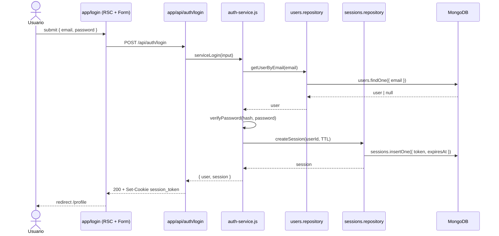
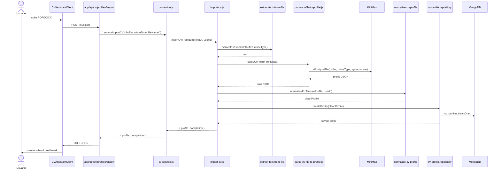
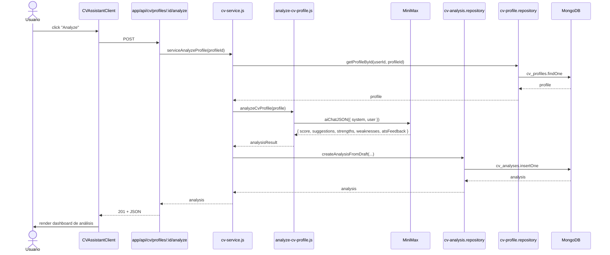
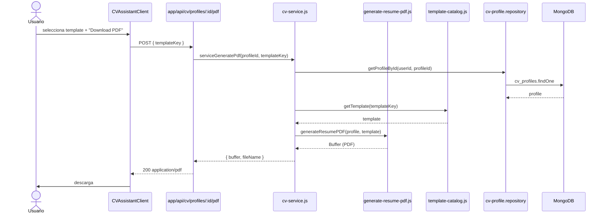
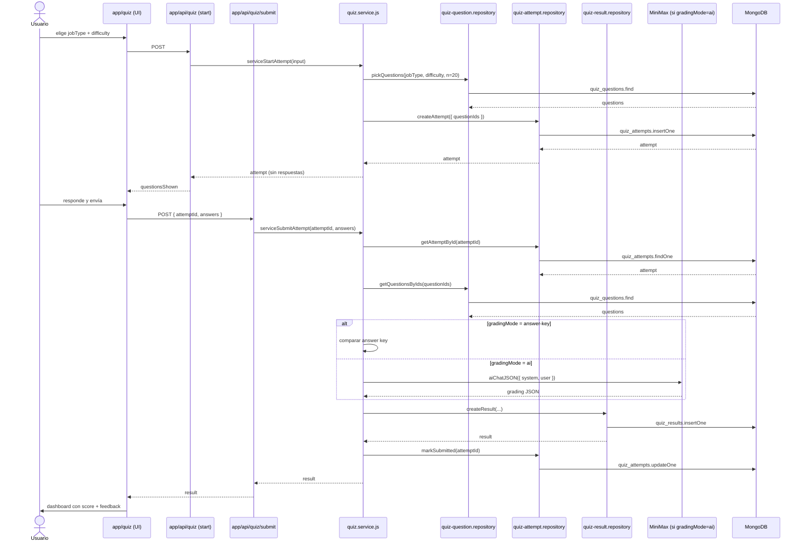
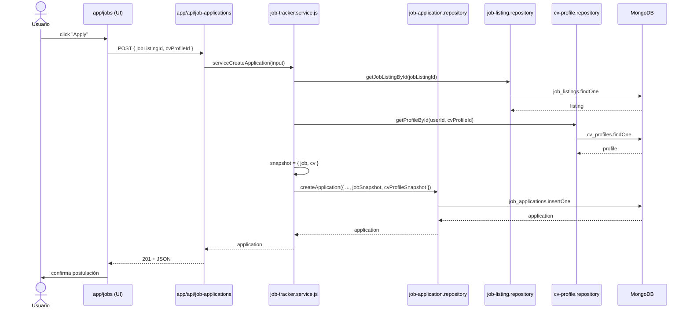
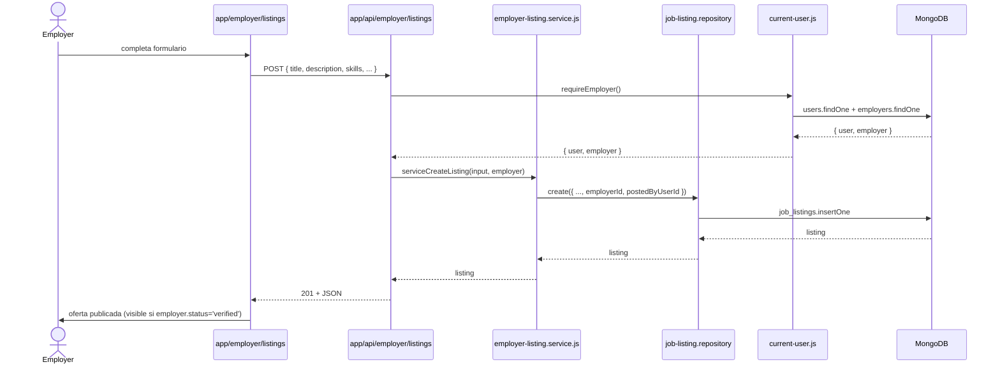
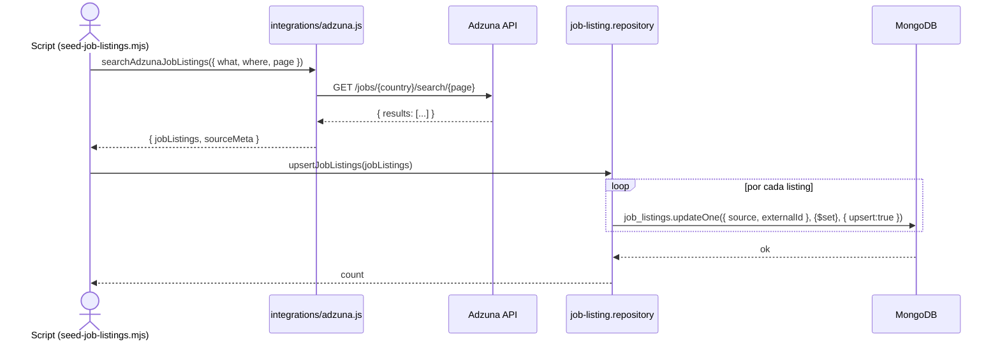

# Flujos de datos clave

Diagramas de secuencia de los flujos más importantes. Cada uno muestra los actores externos (browser, IA, Adzuna) y los módulos internos que se atraviesan.

## Índice

1. [Login](#1-login)
2. [Generación de CV — import desde archivo](#2-import-de-cv-desde-archivo)
3. [Análisis IA de un CV](#3-análisis-ia-de-un-cv)
4. [Generación de PDF del CV](#4-generación-de-pdf)
5. [Quiz: start → submit → grading](#5-quiz-start--submit--grading)
6. [Job application: aplicar a oferta](#6-job-application-aplicar-a-oferta)
7. [Employer: publicar oferta](#7-employer-publicar-oferta)
8. [Import de ofertas desde Adzuna](#8-import-de-ofertas-desde-adzuna)

---

## 1. Login

Notas:
- Cookie es `HttpOnly`, `SameSite=Lax`. La expiración la maneja MongoDB con índice TTL sobre `sessions.expiresAt`.
- `getCurrentUserFromRequest()` (en `lib/server/auth/current-user.js`) se ejecuta en cada RSC padre para hidratar el header.

---

## 2. Import de CV desde archivo

Si el provider IA falla, el import cae a `parse-cv-text-to-profile.js` (parser sin IA) y degrada gracefully.

---

## 3. Análisis IA de un CV

El campo `gradingMode` por defecto es `'ai'`. Reservado `'rule-based'` para fallback cuando no hay API key.

---

## 4. Generación de PDF

El PDF se arma con `pdf-lib` (`devDependencies`). No se guarda en disco; se streamea al cliente.

---

## 5. Quiz: start → submit → grading

Notas:
- El banco de preguntas está limitado a 40/rol (ver [`quiz-question.md`](../data-model/quiz-question.md)).
- Si la IA falla, `quiz.service.js` cae a answer-key grading.

---

## 6. Job application: aplicar a oferta

Notas:
- Los snapshots (`jobSnapshot`, `cvProfileSnapshot`) congelan la oferta y el CV al momento de aplicar. Si el employer edita la oferta después, el applicant sigue viendo el original.
- Cambiar status dispara side-effects: actualizar `lastActivityAt`, opcionalmente crear un `calendar_event`.

---

## 7. Employer: publicar oferta

Solo employers con `status='verified'` ven sus ofertas activas. `pending` y `suspended` las tienen en draft.

---

## 8. Import de ofertas desde Adzuna

Notas:
- El índice `{ source: 1, externalId: 1 }` unique sparse garantiza dedup.
- Si `ADZUNA_APP_ID`/`ADZUNA_APP_KEY` faltan, `isAdzunaConfigured()` retorna `false` y la UI muestra un mensaje "Import disabled".
- El seeder (`scripts/seed-job-listings.mjs`) es seguro de re-ejecutar: solo upserts.

---

## Resumen de patrones transversales

| Patrón | Dónde |
|---|---|
| Service + Repository | `lib/<feature>/server/<feature>.service.js` + `*.repository.js` |
| AI vía abstracción | `lib/services/ai.js` (`aiChat`, `aiChatJSON`, `aiAnalyzeFile`) |
| Soft delete | `deletedAt` (users, job_applications) + `isArchived` (job_applications) |
| Snapshot inmutable | `job_applications.jobSnapshot` + `cvProfileSnapshot` |
| TTL automático | `sessions.expiresAt` con índice TTL |
| Fallback answer-key | `quiz.service.js` cuando la IA falla |