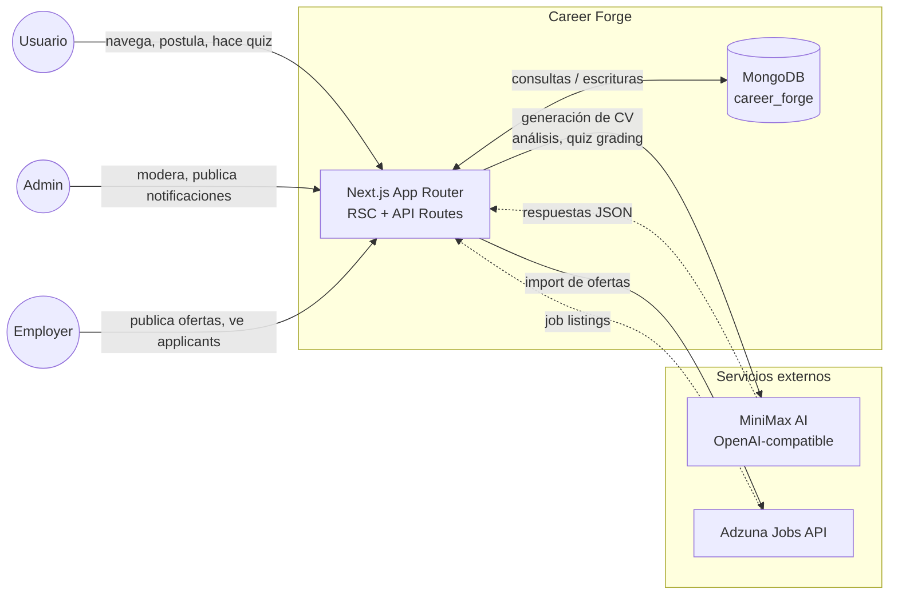
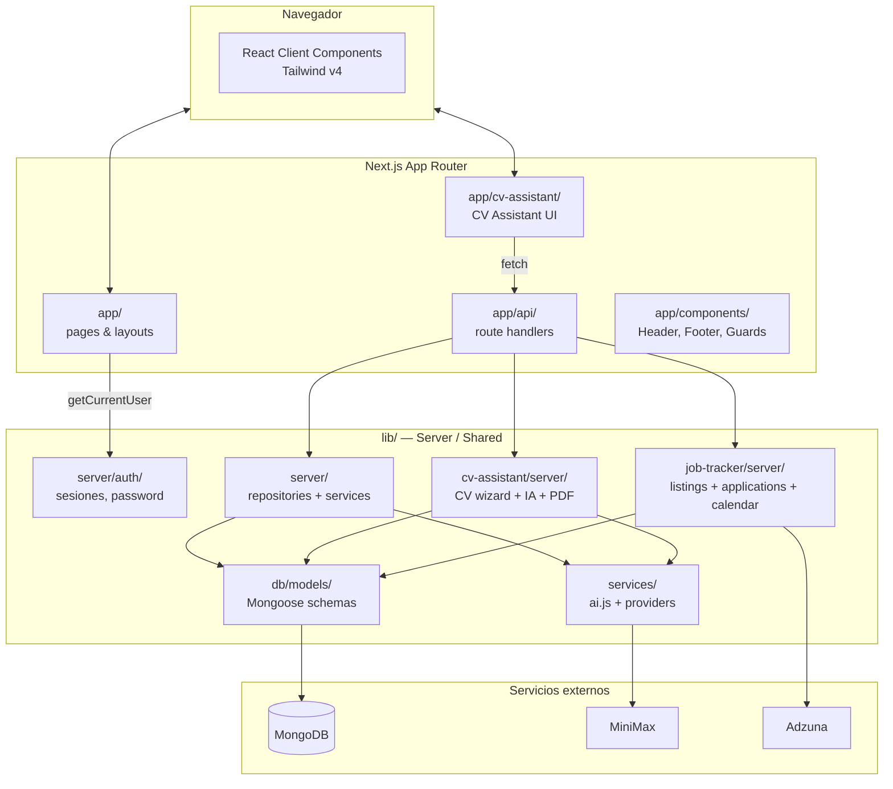

# Visión general de la arquitectura

Career Forge es una aplicación **Next.js (App Router) full-stack** con renderizado híbrido (RSC + Client Components), persistencia en MongoDB y servicios de IA externos. Esta página documenta los dos primeros niveles del modelo C4 adaptados al proyecto.

## Nivel 1 — Vista de sistema

### Actores

- **Usuario** — persona que se registra para usar la plataforma. Crea CVs, toma quizzes, postula a ofertas.
- **Admin** — moderador con acceso al panel `/admin/*`. Gestiona usuarios, notificaciones, empresas y tickets de soporte.
- **Employer** — usuario con rol `employer` vinculado a un documento `employers`. Publica ofertas y ve applicants.

### Sistemas externos

- **MiniMax AI** (`https://api.minimax.io/v1`) — proveedor LLM compatible con la API de OpenAI. Usado por `lib/services/ai/providers/minimax.js`. Configurable vía `MINIMAX_API_KEY`, `MINIMAX_BASE_URL`, `MINIMAX_MODEL`.
- **Adzuna** (`https://api.adzuna.com`) — agregador de ofertas de empleo. Solo se usa si `ADZUNA_APP_ID` + `ADZUNA_APP_KEY` están configurados.

## Nivel 2 — Vista de contenedores / módulos

### Responsabilidades por contenedor

| Contenedor | Carpeta | Responsabilidad |
|---|---|---|
| **Pages** | `app/<feature>/page.jsx` | Rutas server-rendered. Cargan datos vía `lib/server/*` y pasan props a componentes cliente. |
| **API Routes** | `app/api/<feature>/route.js` | Endpoints HTTP. Validan input, llaman servicios, serializan respuesta. Siempre thin. |
| **Components** | `app/components/` | Header, Footer, SessionAccessGuard, ToolPreviewCarousel. Compartidos por todas las páginas. |
| **CV Assistant UI** | `app/cv-assistant/` | Wizard cliente (wizard steps, forms, preview). Consume `/api/cv/*`. |
| **Server auth** | `lib/server/auth/` | Sesiones (cookie + Mongo), hashing de password, current-user helpers. |
| **Services (IA)** | `lib/services/` | Capa de abstracción sobre el proveedor LLM (MiniMax). Token usage tracking. |
| **Models** | `lib/db/models/` | Schemas Mongoose. Capa más baja de acceso a datos. |
| **Repositories / Services** | `lib/server/`, `lib/job-tracker/server/` | Lógica de negocio. Por cada feature: un `<feature>.service.js` (orquestación) + repos por colección. |
| **CV Assistant server** | `lib/cv-assistant/server/` | Wizard server-side: import, parsing, análisis IA, generación de PDF. |
| **Job Tracker server** | `lib/job-tracker/server/` | Listados, postulaciones, eventos de calendario. Integra con Adzuna. |

## Reglas de arquitectura

1. **Routes son thin**: la lógica vive en `lib/*/server/*.service.js`. Las routes solo validan, llaman al servicio y serializan.
2. **Modelos son el límite de datos**: nadie consulta MongoDB directamente fuera de `*.repository.js` (excepto seeds).
3. **IA se accede vía `aiChat`/`aiChatJSON`**: nunca se llama a OpenAI directamente.
4. **Server-only**: archivos en `lib/server/**` y `app/api/**` nunca se importan desde Client Components.
5. **Mock auth, listo para Firebase**: `lib/cv-assistant/server/auth/get-current-user-id.js` retorna `MOCK_USER_ID`. Para integrar Firebase real, reemplazar esa función. El resto del sistema no cambia.
6. **Strict mode off en modelos**: Mongoose está configurado con `strict: false` para permitir evolución de schema sin migraciones explícitas. Los repositorios son los responsables de normalizar antes de escribir.

## Variables de entorno

| Variable | Default | Propósito |
|---|---|---|
| `MONGODB_URI` | `mongodb://127.0.0.1:27017` | Conexión a MongoDB. |
| `MONGODB_DB` | `career_forge` | Base de datos. |
| `MINIMAX_API_KEY` | — | API key del proveedor IA. |
| `MINIMAX_BASE_URL` | `https://api.minimax.io/v1` | Base URL del proveedor. |
| `MINIMAX_MODEL` | `MiniMax-M2.7` | Modelo por defecto. |
| `ADZUNA_APP_ID` | — | App ID Adzuna. Si falta, import deshabilitado. |
| `ADZUNA_APP_KEY` | — | App key Adzuna. |
| `ADZUNA_COUNTRY` | `gb` | País del index Adzuna. |
| `AI_PROVIDER` | `minimax` | Nombre del provider (solo `minimax` soportado hoy). |

## Ver también

- [`data-flow.md`](data-flow.md) — diagramas de secuencia de los flujos clave.
- [`../data-model/collections.md`](../data-model/collections.md) — modelo de datos.
- [`../features/cv-assistant.md`](../features/cv-assistant.md), [`../features/job-tracker.md`](../features/job-tracker.md) — features específicas.