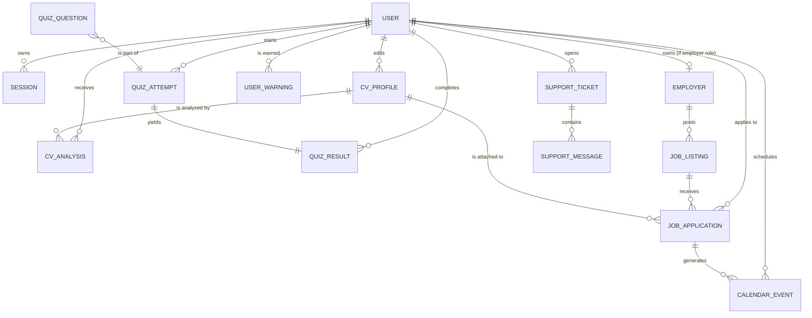

# Modelo de datos — Índice de colecciones

Career Forge persiste toda la información en **MongoDB** (base de datos por defecto: `career_forge`). Las definiciones viven en `lib/db/models/*.js` y se compilan con Mongoose en modo `strict: false`, lo que significa que cada modelo declara los campos tipados pero no rechaza documentos con campos extra.

## Convenciones

- **IDs**: los modelos referencian a otros documentos usando `Mixed` (string `ObjectId` hexadecimal, 24 chars). El helper `lib/server/object-id.js` normaliza string ↔ `ObjectId`.
- **Fechas**: se almacenan como **string ISO-8601** (`new Date().toISOString()`), no como `Date` nativo. Esto evita problemas de serialización entre RSC y cliente.
- **Timestamps**: todos los documentos llevan `createdAt` / `updatedAt` (string ISO-8601). Los repositorios son los responsables de mantenerlos.
- **Soft delete**: las colecciones que soportan borrado lógico exponen `deletedAt` (string ISO o `null`).
- **Indexes**: cada modelo declara sus índices en el schema. Ver tabla resumen abajo.

## Diagrama de entidades

> Las relaciones 1:N entre USER y la mayoría de colecciones se materializan por un campo `userId` (string ObjectId) en el documento hijo. No hay `JOIN`: las consultas se hacen con `find({ userId })`.

## Resumen de colecciones

| Colección | Modelo Mongoose | Documento típico | Índices principales |
|---|---|---|---|
| `users` | `lib/db/models/user.js` | Cuenta de usuario + perfil básico | `email` (unique), `status`, `role` |
| `sessions` | `lib/db/models/session.js` | Sesión activa con cookie token | `token` (unique), `expiresAt` (TTL) |
| `employers` | `lib/db/models/employer.js` | Empresa registrada | `ownerUserId`, `status` |
| `cv_profiles` | `lib/db/models/cv-profile.js` | Perfil de CV editable | `userId+updatedAt`, `userId+isDefault` |
| `cv_analyses` | `lib/db/models/cv-analysis.js` | Resultado de análisis IA de un CV | `userId+profileId+createdAt` |
| `quiz_questions` | `lib/db/models/quiz-question.js` | Pregunta del banco (multi-rol) | `jobType`, `jobType+question` (unique) |
| `quiz_attempts` | `lib/db/models/quiz-attempt.js` | Intento de quiz en curso | `userId+jobType+difficulty+status+createdAt` |
| `quiz_results` | `lib/db/models/quiz-result.js` | Resultado histórico de quiz | `userId+completedAt`, `userId+jobType+completedAt` |
| `job_listings` | `lib/db/models/job-listing.js` | Oferta de empleo (manual o importada) | `isActive+updatedAt`, `category+isActive`, `requiredSkills`, `source+externalId` (unique sparse), `postedByUserId` |
| `job_applications` | `lib/db/models/job-application.js` | Postulación del usuario | `userId+deletedAt+isArchived+updatedAt`, `userId+jobListingId`, `userId+cvProfileId` |
| `calendar_events` | `lib/db/models/calendar-event.js` | Evento del calendario | `userId+eventDate`, `userId+jobApplicationId` |
| `notifications` | `lib/db/models/notification.js` | Notificación global o por usuario | `audience+isPublished+startsAt`, `audience+targetUserId+isPublished+startsAt`, `createdByUserId+createdAt` |
| `user_warnings` | `lib/db/models/user-warning.js` | Advertencia emitida por admin | `userId+createdAt`, `adminId+createdAt` |
| `support_tickets` | `lib/db/models/support-ticket.js` | Ticket de soporte | `userId+lastMessageAt`, `status+lastMessageAt` |
| `support_messages` | `lib/db/models/support-message.js` | Mensaje dentro de un ticket | `ticketId+createdAt` |

## Cardinalidades clave

- **1 usuario → N CV profiles**: un usuario puede tener varios CVs; uno está marcado `isDefault=true`.
- **1 CV profile → N analyses**: cada análisis IA se vincula al perfil evaluado.
- **1 quiz attempt → 1 quiz result**: cuando se envía un intento, se crea exactamente un resultado.
- **1 employer → N job listings**: una empresa publica N ofertas.
- **1 job listing → N job applications**: muchos usuarios pueden aplicar a la misma oferta.
- **1 job application → N calendar events**: cada cambio de estado / fecha puede generar eventos.
- **1 support ticket → N support messages**: conversación append-only.

## Archivos por colección

Cada colección tiene un archivo individual con la estructura JSON completa del documento y notas sobre uso:

- [`user.md`](user.md)
- [`session.md`](session.md)
- [`employer.md`](employer.md)
- [`cv-profile.md`](cv-profile.md)
- [`cv-analysis.md`](cv-analysis.md)
- [`quiz-question.md`](quiz-question.md)
- [`quiz-attempt.md`](quiz-attempt.md)
- [`quiz-result.md`](quiz-result.md)
- [`job-listing.md`](job-listing.md)
- [`job-application.md`](job-application.md)
- [`calendar-event.md`](calendar-event.md)
- [`notification.md`](notification.md)
- [`user-warning.md`](user-warning.md)
- [`support-ticket.md`](support-ticket.md)
- [`support-message.md`](support-message.md)

## Detalles de diseño

### Por qué `Mixed` en vez de `ObjectId`

Para los IDs de referencia se usa `Schema.Types.Mixed` en lugar de `ObjectId`. Esto se debe a que **la serialización RSC** necesita strings, y mantener la coerción en una sola capa (`lib/server/object-id.js`) evita inconsistencias entre cliente y servidor. El índice de MongoDB sigue funcionando porque internamente se almacenan como string hexadecimal de 24 caracteres.

### Por qué fechas como string

Next.js App Router serializa props entre RSC y cliente usando `JSON.stringify`. Los objetos `Date` se serializan a string, pero al deserializar en el cliente se vuelven strings simples (no `Date`). Almacenar fechas como **string ISO-8601** elimina ese problema y permite comparaciones lexicográficas confiables para ordenamiento.

### Soft delete vs hard delete

- `users`, `job_applications`, `job_listings` (vía `isActive`): soportan borrado lógico vía `deletedAt` o `isActive`.
- El resto de las colecciones se eliminan físicamente (hard delete) en sus repositorios.

### TTL en sessions

La colección `sessions` declara un índice TTL sobre `expiresAt` con `expireAfterSeconds: 0`, lo que provoca que MongoDB elimine automáticamente documentos cuando la sesión expira. No requiere cron externo.