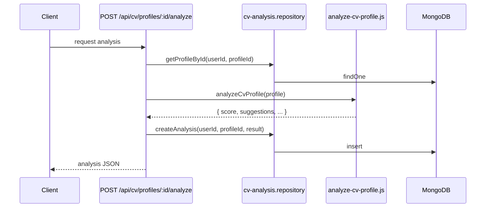

# `cv_analyses`

Resultado del análisis IA de un perfil de CV. Incluye feedback ATS (Applicant Tracking System), puntaje global, sugerencias, fortalezas y debilidades.

**Colección MongoDB:** `cv_analyses`
**Modelo Mongoose:** `lib/db/models/cv-analysis.js`
**Función exportada:** `getCvAnalysisModel()`

## Estructura del documento

```json
{
  "_id": "ObjectId",
  "userId": "string ObjectId",
  "profileId": "string ObjectId",
  "atsFeedback": "object",
  "overallScore": "number (0-100)",
  "suggestions": "object",
  "strengths": "object",
  "weaknesses": "object",
  "gradingMode": "'ai' | 'rule-based' (default 'ai')",
  "lastEditedByUserId": "string ObjectId | null",
  "lastEditedAt": "string ISO-8601 | null",
  "lastEditedReason": "string | null",
  "createdAt": "string ISO-8601"
}
```

## Campos

| Campo | Tipo | Notas |
|---|---|---|
| `userId` | string | Quién pidió el análisis. |
| `profileId` | string | Sobre qué CV se ejecutó. |
| `atsFeedback` | object | Output estructurado del parser ATS (palabras clave detectadas, formato, longitud). |
| `overallScore` | number | 0-100. Calculado por IA. |
| `suggestions` | object | Lista priorizada de mejoras. |
| `strengths` | object | Lista de fortalezas detectadas. |
| `weaknesses` | object | Lista de debilidades detectadas. |
| `gradingMode` | string | `'ai'` por defecto. Reservado para fallback rule-based. |
| `lastEditedByUserId` / `lastEditedAt` / `lastEditedReason` | varios | Audit trail cuando un admin edita manualmente el feedback. |

## Índices

- `{ userId: 1, profileId: 1, createdAt: -1 }` (`cv_analysis_user_profile_created`).

## Relaciones

- **N:1 → `users`**.
- **N:1 → `cv_profiles`**.

## Flujo de generación



Más detalle en [`features/cv-assistant.md`](../features/cv-assistant.md).

## Ver también

- [`cv-profile.md`](cv-profile.md)
- [`features/cv-assistant.md`](../features/cv-assistant.md)