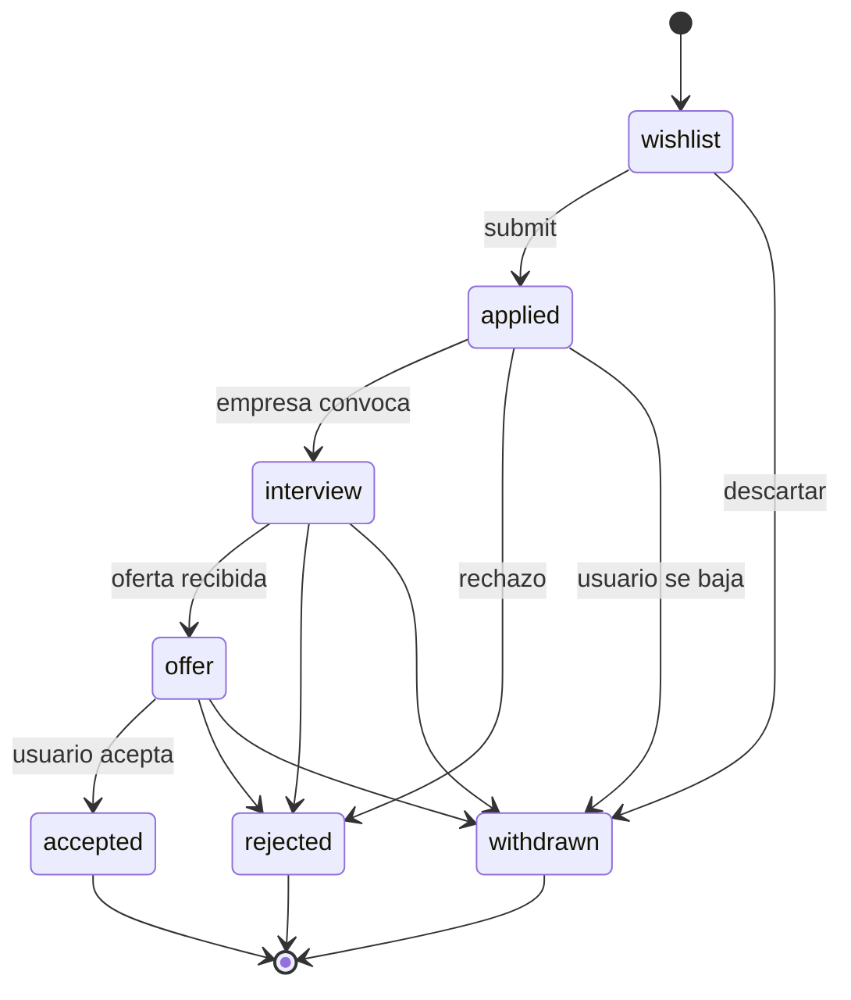

# `job_applications`

Postulación de un usuario a una oferta. Guarda snapshots del CV y de la oferta al momento de aplicar (para que el historial sea estable aunque la oferta cambie).

**Colección MongoDB:** `job_applications`
**Modelo Mongoose:** `lib/db/models/job-application.js`
**Función exportada:** `getJobApplicationModel()`

## Estructura del documento

```json
{
  "_id": "ObjectId",
  "userId": "string ObjectId",
  "jobListingId": "string ObjectId | null",
  "jobSnapshot": "object",
  "cvProfileId": "string ObjectId",
  "cvProfileSnapshot": "object",
  "status": "'wishlist' | 'applied' | 'interview' | 'offer' | 'rejected' | 'accepted' | 'withdrawn'",
  "previousStatus": "string | null",
  "appliedAt": "string ISO-8601 | null",
  "lastActivityAt": "string ISO-8601",
  "promisedResponseDate": "string ISO-8601 | null",
  "notes": "string",
  "adaptedDescription": "string",
  "isArchived": "boolean (default false)",
  "archivedAt": "string ISO-8601 | null",
  "archivedReason": "string | null",
  "deletedAt": "string ISO-8601 | null",
  "createdAt": "string ISO-8601",
  "updatedAt": "string ISO-8601"
}
```

## Campos

| Campo | Tipo | Notas |
|---|---|---|
| `userId` | string | Quién postuló. |
| `jobListingId` | string | FK a `job_listings._id`. Puede ser `null` si la oferta externa se borró. |
| `jobSnapshot` | object | Copia inmutable de la oferta al momento de aplicar. Permite historial estable. |
| `cvProfileId` | string | CV enviado. |
| `cvProfileSnapshot` | object | Copia del CV. |
| `status` | enum | Estado en el pipeline del usuario. |
| `previousStatus` | string | Estado anterior (para detectar transiciones y disparar eventos). |
| `appliedAt` | string | Cuándo pasó a `applied`. |
| `lastActivityAt` | string | Última interacción (cambio de estado, nota, etc.). |
| `promisedResponseDate` | string | Si la empresa dio SLA, cuándo prometió responder. |
| `notes` | string | Notas libres del usuario. |
| `adaptedDescription` | string | Descripción adaptada al puesto (generada por IA opcionalmente). |
| `isArchived` / `archivedAt` / `archivedReason` | varios | Soft archive (el usuario decide ocultar). |
| `deletedAt` | string | Soft delete. |

## Estados (`status`)



## Índices

- `{ userId: 1, deletedAt: 1, isArchived: 1, updatedAt: -1 }` (`job_applications_user_state_updated`).
- `{ userId: 1, jobListingId: 1 }` (`job_applications_user_listing`).
- `{ userId: 1, cvProfileId: 1 }` (`job_applications_user_cv_profile`).

## Snapshots: por qué importan

Si un employer edita una oferta después de que un usuario aplicó, el `jobSnapshot` congela el texto que vio el candidato. Lo mismo con el CV: el usuario puede actualizar su CV sin que el enviado a la oferta X cambie retroactivamente.

## Relaciones

- **N:1 → `users`**.
- **N:1 → `job_listings`** (lógica).
- **N:1 → `cv_profiles`**.
- **1:N → `calendar_events`** (cambios de estado programan eventos).

## Ver también

- [`job-listing.md`](job-listing.md)
- [`cv-profile.md`](cv-profile.md)
- [`calendar-event.md`](calendar-event.md)
- [`features/job-tracker.md`](../features/job-tracker.md)