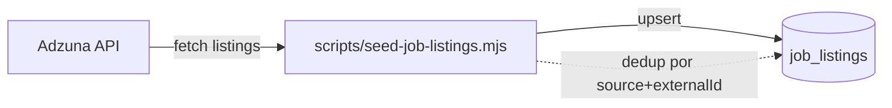

# `job_listings`

Ofertas de empleo en la plataforma. Pueden ser **internas** (publicadas por un employer) o **externas** (importadas desde Adzuna u otra fuente).

**Colección MongoDB:** `job_listings`
**Modelo Mongoose:** `lib/db/models/job-listing.js`
**Función exportada:** `getJobListingModel()`

## Estructura del documento

```json
{
  "_id": "ObjectId",
  "source": "'internal' | 'adzuna' | 'manual'",
  "externalId": "string | null",
  "title": "string",
  "company": "string",
  "location": "string",
  "description": "string",
  "salaryMin": "number | null",
  "salaryMax": "number | null",
  "url": "string | null",
  "requiredSkills": "string[]",
  "category": "string",
  "employmentType": "'full_time' | 'part_time' | 'contract' | 'internship' | 'temporary' | 'freelance' | 'other' | null",
  "postedAt": "string ISO-8601 | null",
  "isActive": "boolean (default true)",
  "postedByUserId": "string ObjectId | null",
  "employerId": "string ObjectId | null",
  "createdAt": "string ISO-8601",
  "updatedAt": "string ISO-8601"
}
```

## Campos

| Campo | Tipo | Notas |
|---|---|---|
| `source` | string | Origen de la oferta. Define cómo se actualiza. |
| `externalId` | string | ID en el sistema externo (ej. Adzuna). Único junto con `source` (índice sparse unique). |
| `title` | string | Título del puesto. |
| `company` | string | Nombre mostrado de la empresa. |
| `location` | string | Ciudad / región / "Remote". |
| `description` | string | Texto completo (HTML o markdown según el source). |
| `salaryMin` / `salaryMax` | number | Rango salarial anual. |
| `url` | string | URL externa para aplicar (solo en `source != 'internal'`). |
| `requiredSkills` | string[] | Skills extraídas del texto. Usadas para matching. |
| `category` | string | Categoría agrupadora (tecnología, salud, retail, etc.). |
| `employmentType` | enum | Tipo de contrato. |
| `postedAt` | string | Cuándo se publicó originalmente. |
| `isActive` | boolean | `false` = oferta cerrada/expirada, no visible. |
| `postedByUserId` | string | Si fue publicada internamente, quién la creó. |
| `employerId` | string | FK a `employers._id` (si `source == 'internal'`). |

## Índices

- `{ isActive: 1, updatedAt: -1 }` (`job_listings_active_updated`) — feed principal.
- `{ category: 1, isActive: 1 }` (`job_listings_category_active`) — filtro por categoría.
- `{ requiredSkills: 1 }` (`job_listings_required_skills`) — multikey para búsqueda por skill.
- `{ source: 1, externalId: 1 }` unique sparse (`job_listings_source_external_id`) — dedup de imports.
- `{ postedByUserId: 1 }` (`job_listings_posted_by`).

## Relaciones

- **N:1 → `employers`** (si `source == 'internal'`).
- **N:1 → `users`** (vía `postedByUserId`, si fue publicada por un employer-owner).
- **1:N → `job_applications`**.

## Flujo de importación



## Ver también

- [`job-application.md`](job-application.md)
- [`employer.md`](employer.md)
- [`features/job-tracker.md`](../features/job-tracker.md)