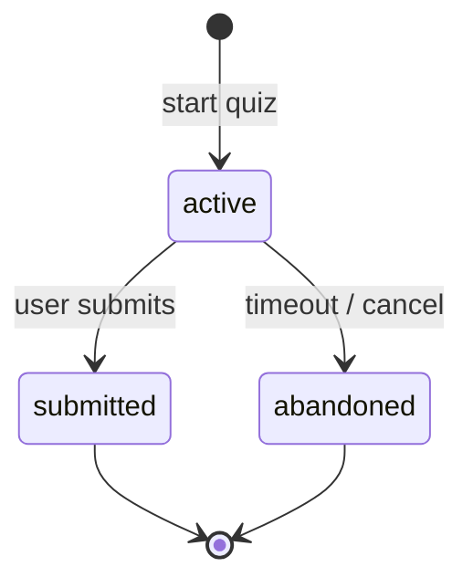

# `quiz_attempts`

Intento activo (o histórico) de un quiz. Se crea al iniciar un quiz y se marca como `submitted` cuando el usuario envía respuestas. Un intento genera **exactamente un** `quiz_result`.

**Colección MongoDB:** `quiz_attempts`
**Modelo Mongoose:** `lib/db/models/quiz-attempt.js`
**Función exportada:** `getQuizAttemptModel()`

## Estructura del documento

```json
{
  "_id": "ObjectId",
  "userId": "string ObjectId (required)",
  "jobType": "string (required)",
  "difficulty": "string (required)",
  "questionIds": "string[] (ObjectId[])",
  "status": "'active' | 'submitted' | 'abandoned' (default 'active')",
  "generationMode": "'bank' | 'ai' (default 'bank')",
  "createdAt": "string ISO-8601 (required)",
  "updatedAt": "string ISO-8601 (required)",
  "submittedAt": "string ISO-8601 | null"
}
```

## Campos

| Campo | Tipo | Notas |
|---|---|---|
| `userId` | string | Quién está respondiendo. |
| `jobType` | string | Rol elegido. |
| `difficulty` | string | Nivel. |
| `questionIds` | ObjectId[] | IDs de las preguntas asignadas. Se congelan al crear el intento. |
| `status` | string | `active` (en curso), `submitted` (respondido), `abandoned` (expirado). |
| `generationMode` | string | `bank` (del banco) o `ai` (generadas on-demand). |
| `submittedAt` | string \| null | Timestamp del envío. |

## Índices

- `{ userId: 1, jobType: 1, difficulty: 1, status: 1, createdAt: -1 }` (`quiz_attempts_user_role_level_status`).

## Ciclo de vida



## Relaciones

- **N:1 → `users`**.
- **N:M → `quiz_questions`** vía `questionIds`.
- **1:1 → `quiz_results`** (uno por intento enviado).

## Ver también

- [`quiz-question.md`](quiz-question.md)
- [`quiz-result.md`](quiz-result.md)