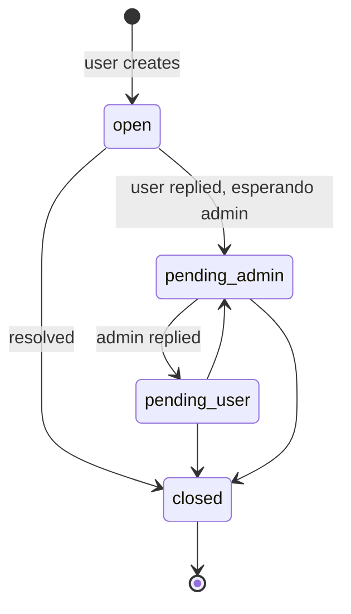

# `support_tickets`

Ticket de soporte abierto por un usuario. La conversación vive en `support_messages`.

**Colección MongoDB:** `support_tickets`
**Modelo Mongoose:** `lib/db/models/support-ticket.js`
**Función exportada:** `getSupportTicketModel()`

## Estructura del documento

```json
{
  "_id": "ObjectId",
  "userId": "string ObjectId",
  "subject": "string",
  "status": "'open' | 'pending_user' | 'pending_admin' | 'closed' (default 'open')",
  "lastMessageAt": "string ISO-8601",
  "lastMessageBy": "'user' | 'admin'",
  "createdAt": "string ISO-8601",
  "updatedAt": "string ISO-8601"
}
```

## Campos

| Campo | Tipo | Notas |
|---|---|---|
| `userId` | string | Quien abrió. |
| `subject` | string | Resumen corto. |
| `status` | string | Estado del flujo. |
| `lastMessageAt` | string | Para ordenar bandejas. |
| `lastMessageBy` | string | Quién escribió último (define a quién le toca responder). |

## Índices

- `{ userId: 1, lastMessageAt: -1 }` (`support_tickets_user_lastMessage`).
- `{ status: 1, lastMessageAt: -1 }` (`support_tickets_status_lastMessage`).

## Estados



## Relaciones

- **N:1 → `users`**.
- **1:N → `support_messages`**.

## Ver también

- [`support-message.md`](support-message.md)
- `features/admin.md` *(próxima iteración)*