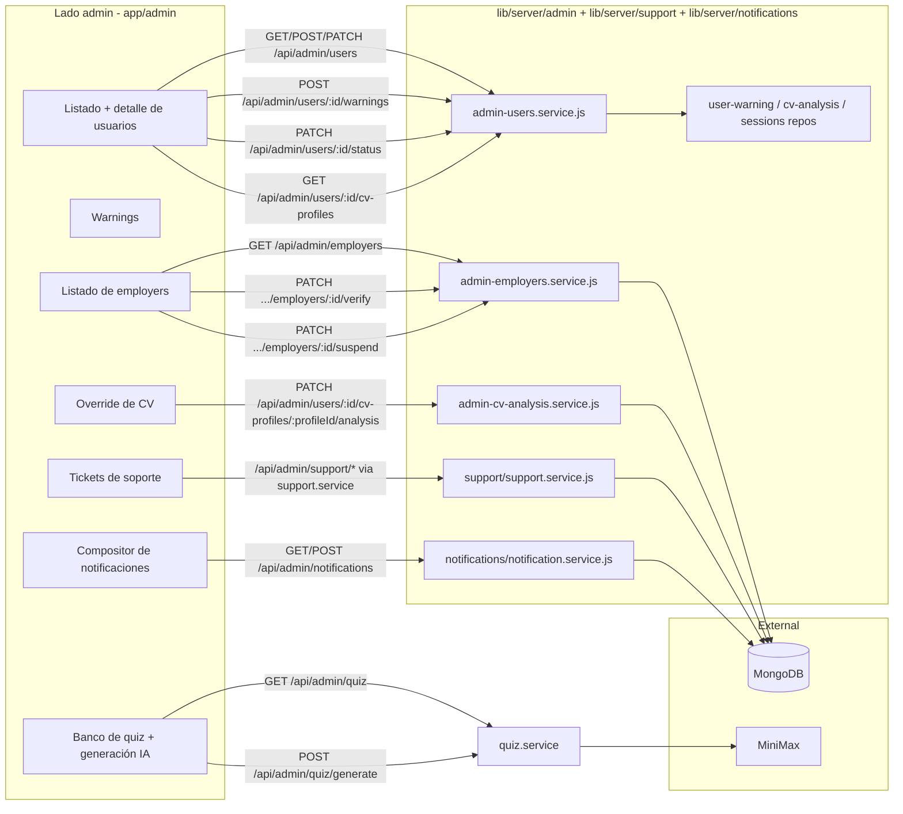
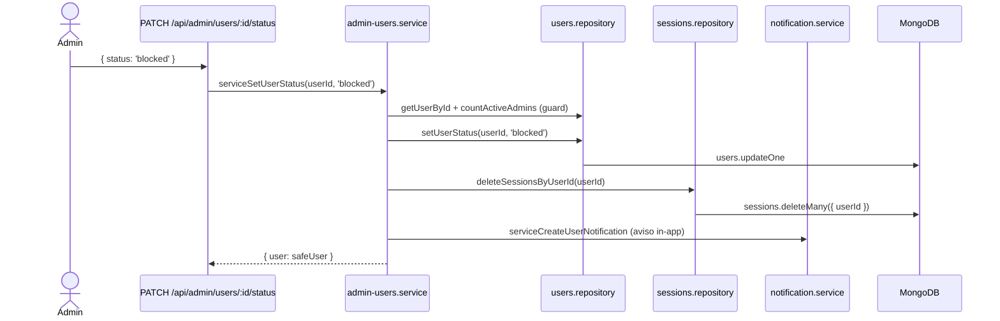
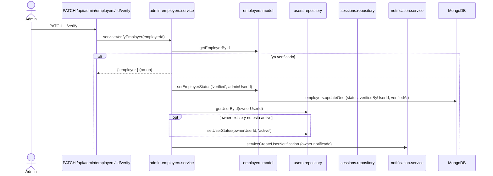
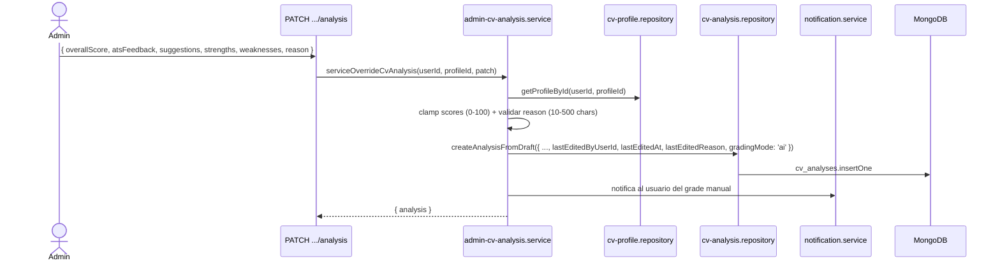

# Admin

El módulo Admin da a los moderadores control operativo total sobre Career Forge: gestión de usuarios (estado, warnings, lifecycle), verificación/suspensión de employers, override manual de análisis de CV, triage de tickets de soporte, y notificaciones globales de plataforma.

## Vista general

Cada route handler admin delega a un servicio en `lib/server/admin/`. Cada servicio arranca con `await requireAdminUser()`.

## Gestión de usuarios

Vive en `lib/server/admin/admin-users.service.js`.

### Listar usuarios

`GET /api/admin/users?status=&role=&search=&page=`

- Filtros: `status`, `role`, free-text `search` (email/nombre).
- Paginación: `page`, `pageSize` (default 10, max 100).
- Devuelve `{ users, page, pageSize, total, totalPages }`.

### Crear usuario

`POST /api/admin/users { firstName, lastName, email, password, role }` — el admin crea un usuario directamente. Hashea la password con el mismo helper del registro público.

### Ver detalle de usuario

`GET /api/admin/users/:userId` — devuelve:

- User seguro (sin `passwordHash`).
- Resumen de sus CV profiles.
- Último análisis de CV por profile.
- Conteos agregados: applications, calendar events, quiz results, warnings, support tickets.

### Cambiar status

`PATCH /api/admin/users/:userId/status { status }`

Transiciones permitidas: `active`, `blocked`, `deleted`. **Un admin no puede degradar al último admin activo** (guard `countActiveAdmins > 1`). Cuando el status pasa a `blocked` o `deleted`, todas las sesiones del usuario se eliminan vía `deleteSessionsByUserId`.

### Emitir warnings

`POST /api/admin/users/:userId/warnings { message }`

Persiste un documento `user_warnings` y opcionalmente notifica al usuario. Los warnings se acumulan y son usados por flujos de soporte / moderación.

### Reactivar / restaurar

Los admins pueden mover un usuario `deleted` o `suspended` de vuelta a `active`. Las sesiones no se restauran (el usuario debe volver a loguearse).

## Verificación de employers

`lib/server/admin/admin-employers.service.js` maneja el flujo de aprobación.

La suspensión (`.../suspend`) es el flujo inverso: el status pasa a `suspended`, el user owner pasa a `blocked`, se eliminan todas sus sesiones y se manda una notificación. Sus `job_listings` pasan a inactivos (vía `isActive=false`, propagado por el servicio del employer).

## Override de CV-analysis

`PATCH /api/admin/users/:userId/cv-profiles/:profileId/analysis` ejecuta `serviceOverrideCvAnalysis` (`lib/server/admin/admin-cv-analysis.service.js`).

Permite al admin corregir manualmente un análisis generado por IA:

Esto preserva el audit trail (`lastEditedByUserId`, `lastEditedAt`, `lastEditedReason`) mientras deja a los admins corregir errores.

## Notificaciones

`lib/server/notifications/notification.service.js` maneja mensajes broadcast del admin y per-user.

| Endpoint | Método | Propósito |
|---|---|---|
| `/api/admin/notifications` | GET | Listar todas las notificaciones (admin). |
| `/api/admin/notifications` | POST | Crear + publicar. |
| `/api/notifications` | GET | Listar notificaciones visibles para el usuario actual. |

Las notificaciones tienen:

- `audience`: `'all' | 'admins' | 'employers' | 'user'`.
- `targetUserId`: requerido cuando `audience === 'user'`.
- `startsAt` / `expiresAt`: ventana de tiempo.
- `isPublished`: draft vs live.

Un sweeper scheduled (impulsado por las lecturas con el índice `{ audience, isPublished, startsAt }`) esconde las expiradas.

## Triage de tickets de soporte

El admin usa los mismos endpoints `/api/support/tickets` que los usuarios, con query params extra: `status`, `search`, `sort`, `page`, `pageSize`.

`lib/server/support/support.service.js` expone:

- `serviceListTickets` — el admin ve todos los tickets, paginado.
- `serviceSearchTickets` — full-text sobre subject/body.
- `serviceGetTicketStats` — conteos por status.
- `serviceUpdateTicketStatus` — transiciones de status solo admin.

Ver [`../data-model/support-ticket.md`](../data-model/support-ticket.md) y [`../data-model/support-message.md`](../data-model/support-message.md) para el modelo de conversación.

## Permisos

| Rol | Puede acceder a endpoints admin |
|---|---|
| `user` | No. |
| `employer` (verificado o no) | No. |
| `admin` | Sí — todas las rutas `/api/admin/*`. |

Helper: `requireAdminUser()` en `lib/server/auth/current-user.js`.

## Safety rails

El servicio de admin codifica varias reglas de seguridad no obvias. Vale la pena resaltarlas porque protegen a los usuarios de lock-outs accidentales:

1. **Guard del último admin**: no se puede degradar o eliminar al último admin activo (`countActiveAdmins > 1`).
2. **Auto-protección**: un admin no puede degradar o eliminarse a sí mismo.
3. **Session wipe**: cualquier cambio de status a `blocked` o `deleted` llama inmediatamente `deleteSessionsByUserId` para que el usuario afectado quede deslogueado en todos lados.
4. **Audit trail en CV overrides**: `lastEditedByUserId`, `lastEditedAt`, `lastEditedReason` son obligatorios; el reason debe tener 10-500 chars.
5. **Cascada de suspensión de employer**: el user owner pasa a `blocked`, las sesiones se eliminan, los listings pasan a inactivos.

## Ver también

- [`../data-model/user.md`](../data-model/user.md), [`../data-model/user-warning.md`](../data-model/user-warning.md)
- [`../data-model/employer.md`](../data-model/employer.md), [`../data-model/notification.md`](../data-model/notification.md)
- [`../data-model/support-ticket.md`](../data-model/support-ticket.md)
- [`../features/cv-assistant.md`](../features/cv-assistant.md) — targets del override manual
- [`../features/job-tracker.md`](../features/job-tracker.md) — contexto de verificación de employer
- [`../features/quiz.md`](../features/quiz.md) — endpoints admin de quiz