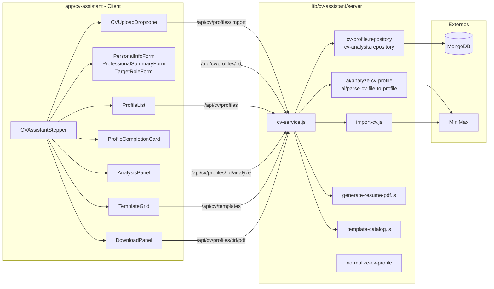
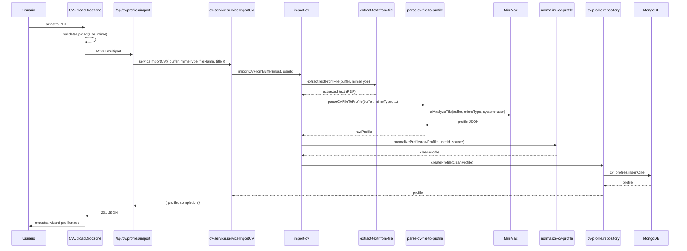
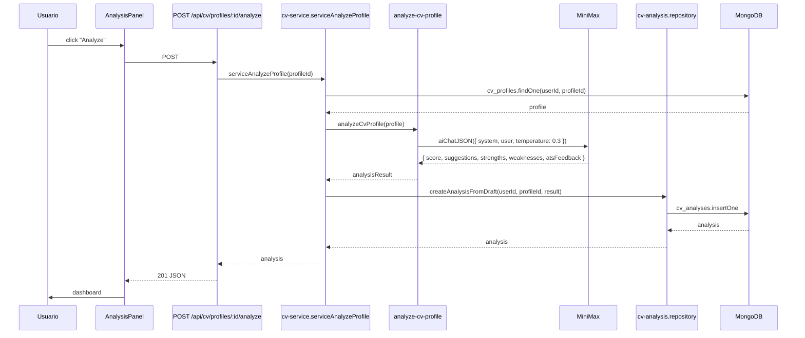
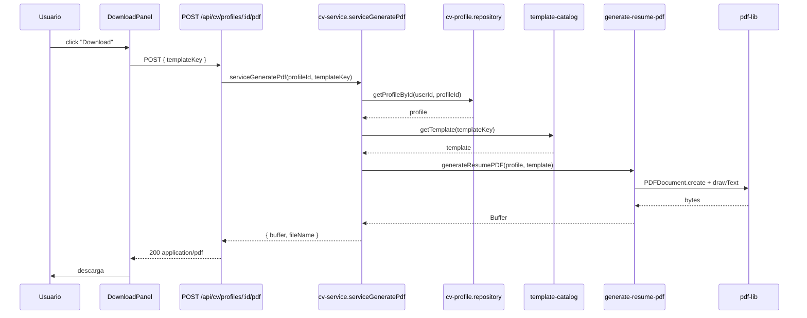

# CV Assistant

El CV Assistant es la feature más rica de Career Forge: permite a un usuario crear uno o más perfiles de CV a partir de un PDF, revisar y editar la información con un wizard, recibir análisis IA con feedback ATS, elegir entre varios templates y descargar un PDF final listo para enviar.

## Vista general

## Pasos del wizard

Definidos en `lib/cv-assistant/ui-steps.js`:

| Paso | Label | Componente principal | Endpoint |
|---|---|---|---|
| 01 | Upload & Profiles | `CVUploadDropzone` + `ProfileList` | `POST /api/cv/profiles/import`, `GET /api/cv/profiles` |
| 02 | Review Profile | `PersonalInfoForm`, `ProfessionalSummaryForm`, `TargetRoleForm` | `GET/PATCH /api/cv/profiles/[profileId]` |
| 03 | AI Analysis | `AnalysisPanel` | `POST /api/cv/profiles/[profileId]/analyze`, `GET /api/cv/profiles/[profileId]/analyses` |
| 04 | Templates | `TemplateGrid` | `GET /api/cv/templates`, `POST /api/cv/templates/:key/evaluate` |
| 05 | Download | `DownloadPanel` | `POST /api/cv/profiles/[profileId]/pdf` |

## Pipeline de import (de PDF a perfil)

Puntos clave:

- **Solo PDF**: la validación rechaza otros formatos (`UNSUPPORTED_FILE_TYPE`).
- **Buffer nunca persistido**: solo se guarda el JSON estructurado en `cv_profiles`.
- **Fallback**: si la IA falla (`AIServiceError`), se cae a `parse-cv-text-to-profile.js` (parser sin IA) para evitar bloqueo total.
- **Source tracking**: el campo `source.type` se setea a `'uploaded_cv'` con `originalFileName`, `originalFileType`, `parsedAt` para auditoría.

## Pipeline de análisis IA

Lo que produce el análisis:

- `overallScore` (0-100)
- `atsFeedback` — feedback estructurado para Applicant Tracking Systems
- `suggestions` — mejoras priorizadas
- `strengths` / `weaknesses`
- `gradingMode` — `'ai'` por defecto, `'rule-based'` reservado para fallback

El análisis queda persistido en `cv_analyses` con índice `{ userId, profileId, createdAt: -1 }`. El panel muestra los últimos N análisis.

## Templates de CV

`lib/cv-assistant/template-catalog.js` declara el catálogo. Cada template define `requiredFields` y `recommendedFields` que se evalúan contra el perfil.

| Key | Categoría | Caso de uso |
|---|---|---|
| `harvard-classic` | `classic` | Estudiantes, internships, business/finance/consulting. |
| `ats-simple` | `ats` | Postulaciones online, ATS corporativos, claridad sobre diseño. |
| `reverse-chronological-professional` | `professional` | Trayectoria clara, ascendente. |
| `technical-projects` | `technical` | Roles técnicos con peso en proyectos. |
| `hybrid-combination` | `hybrid` | Combina skills + experiencia. |

Evaluación: `POST /api/cv/templates/:key/evaluate` corre `evaluateTemplate(profile, template)` y devuelve:

- `status`: `'available'` | `'recommended'` | `'needs_more_information'` | `'not_recommended'`
- `missingRequired`: lista de campos faltantes
- `missingRecommended`: lista de recomendaciones

El stepper fuerza a ir al step correcto según `stepForTemplate(templateKey)`.

## Generación de PDF

Notas:
- `pdf-lib` (`devDependencies`) es la única dependencia de PDF.
- El PDF se streamea; nunca se guarda en disco del servidor.

## Modelo de datos relacionado

- [`cv_profile`](../data-model/cv-profile.md) — perfil editable con `completion.percent` recalculado en cada save.
- [`cv_analysis`](../data-model/cv-analysis.md) — análisis IA persistidos por perfil.
- Tipos compartidos en [`lib/cv-assistant/types.js`](../../lib/cv-assistant/types.js): `SeniorityLevel`, `EmploymentType`, `LanguageProficiency`, `LinkType`, `SourceType`, `AnalysisPriority`, `TemplateStatus`, `TemplateCategory`, `CVTemplateKey`.

## Auth actual

`lib/cv-assistant/server/auth/get-current-user-id.js` retorna `MOCK_USER_ID`. Esto permite desarrollar el feature end-to-end sin Firebase. Para producción, ver guía en `AGENTS.md`.

## Tests

- `app/cv-assistant/__tests__/` — tests de componentes UI (Vitest + jsdom).
- `lib/cv-assistant/test/mongo-helpers.js` — helper para tests de integración con `MongoMemoryServer`.
- `lib/cv-assistant/server/*.test.js` — tests del servicio, repos y AI mocks.

## Ver también

- [`../architecture/data-flow.md`](../architecture/data-flow.md#2-import-de-cv-desde-archivo)
- [`../architecture/data-flow.md`](../architecture/data-flow.md#3-análisis-ia-de-un-cv)
- [`../architecture/data-flow.md`](../architecture/data-flow.md#4-generación-de-pdf)