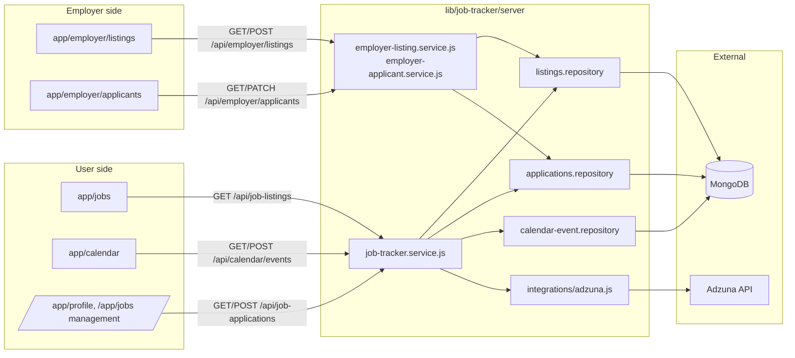
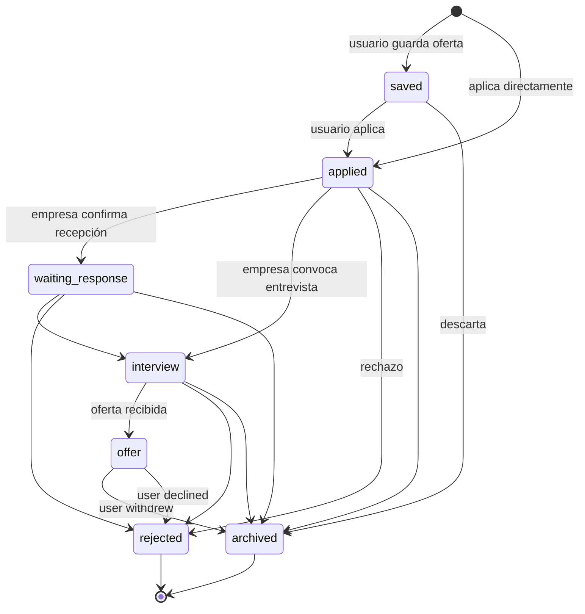
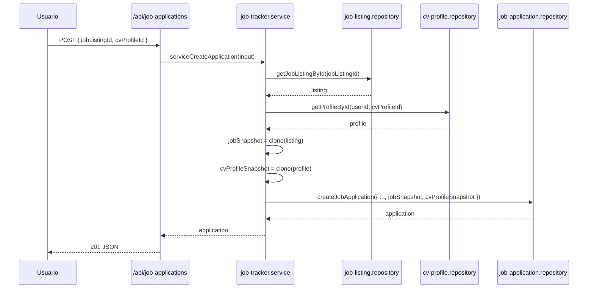
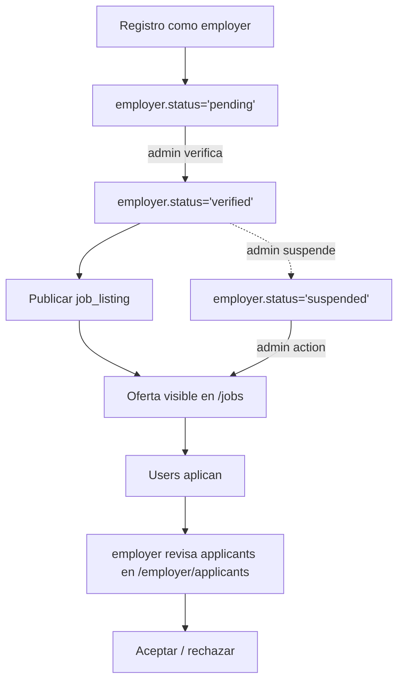
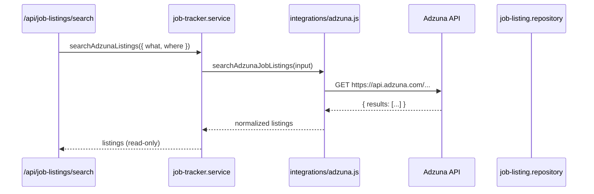
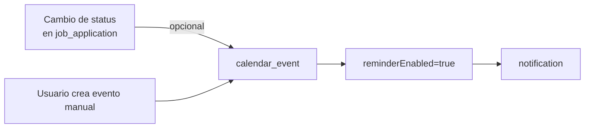

# Job Tracker

Job Tracker es el módulo que cubre todo el ciclo de postulación: descubrimiento de ofertas (internas + importadas de Adzuna), gestión del pipeline del candidato (wishlist → applied → interview → offer), calendario de eventos y portal del employer para publicar ofertas y revisar applicants.

## Vista general

## Modelos de datos involucrados

- [`job_listings`](../data-model/job-listing.md) — ofertas (internas + externas).
- [`job_applications`](../data-model/job-application.md) — postulaciones del usuario.
- [`calendar_events`](../data-model/calendar-event.md) — entrevistas y recordatorios.
- [`employers`](../data-model/employer.md) — empresas registradas.
- [`cv_profiles`](../data-model/cv-profile.md) — CVs del usuario (se asocian a la postulación).

## Estados de una postulación

Definidos en `lib/job-tracker/server/job-tracker.service.js` (`ALLOWED_APPLICATION_STATUSES`):

Cada transición:

- Actualiza `lastActivityAt` y `previousStatus` (para detectar cambios).
- Si `status === 'interview'` o `status === 'offer'`, el servicio puede crear automáticamente un `calendar_event` (configurable).

## Snapshots inmutables

Al crear una `job_application`, el servicio congela:

- `jobSnapshot` — copia del `job_listing` al momento de aplicar.
- `cvProfileSnapshot` — copia del `cv_profile` enviado.

Esto permite que si el employer edita la oferta o el usuario actualiza su CV, **el applicant histórico siga viendo lo que envió**.

## Pipeline del employer

- El employer **no puede publicar ofertas** hasta que su `employer.status` sea `'verified'`.
- Una vez suspendido, sus listings pasan a `isActive=false`.
- El endpoint `/api/employer/applicants/[applicationId]` filtra por `employerId` del requester: un employer solo ve applicants a **sus propias** ofertas.

## Import desde Adzuna

- El import es **on-demand** (no pre-puebla la DB por defecto). El script `scripts/seed-job-listings.mjs` hace upsert masivo a `job_listings`.
- Si `ADZUNA_APP_ID`/`ADZUNA_APP_KEY` faltan, `isAdzunaConfigured()` retorna `false` y la UI muestra "Import disabled".
- Índice único sparse `{ source: 1, externalId: 1 }` garantiza dedup automático.

## Calendario

Eventos posibles (`ALLOWED_EVENT_TYPES`):

- `interview` — entrevista programada.
- `deadline` — fecha límite para responder.
- `follow_up` — recordatorio para hacer follow-up.
- `promised_response` — fecha prometida por la empresa.
- `reminder` — recordatorio genérico.

Los eventos están vinculados a una `job_application` (`scope === 'application'`) o son personales (`scope === 'personal'`).

## API surface

| Endpoint | Método | Propósito |
|---|---|---|
| `/api/job-listings` | GET | Listar ofertas activas. |
| `/api/job-listings/[id]` | GET | Detalle de una oferta. |
| `/api/job-applications` | GET / POST | Listar / crear postulaciones. |
| `/api/job-applications/[id]` | GET / PATCH / DELETE | Detalle + cambio de status + soft delete. |
| `/api/job-applications/[id]/restore` | POST | Restaurar soft-deleted. |
| `/api/calendar/events` | GET / POST | Listar / crear eventos. |
| `/api/calendar/events/[id]` | GET / PATCH / DELETE | Detalle de evento. |
| `/api/employer/listings` | GET / POST | Employer: listar / publicar ofertas. |
| `/api/employer/listings/[id]` | GET / PATCH / DELETE | Employer: editar / cerrar oferta. |
| `/api/employer/applicants` | GET | Employer: listar applicants. |
| `/api/employer/applicants/[id]` | GET / PATCH | Employer: revisar y decidir. |
| `/api/employer/applicants/[id]/profile` | GET | Employer: ver CV snapshot completo. |

## Permisos

| Rol | Puede ver | Puede escribir |
|---|---|---|
| `user` | Sus propias applications, events, listings activas | Sus propias applications, events |
| `employer` (verified) | Sus listings, applicants a sus listings | Sus listings |
| `employer` (pending/suspended) | Sus listings (no activas) | — |
| `admin` | Todo | Todo |

`lib/server/auth/current-user.js` provee helpers `requireCurrentUser()`, `requireAdminUser()`, `requireEmployer()`.

## Ver también

- [`../architecture/data-flow.md`](../architecture/data-flow.md#6-job-application-aplicar-a-oferta)
- [`../architecture/data-flow.md`](../architecture/data-flow.md#7-employer-publicar-oferta)
- [`../architecture/data-flow.md`](../architecture/data-flow.md#8-import-de-ofertas-desde-adzuna)
- [`../data-model/job-listing.md`](../data-model/job-listing.md)
- [`../data-model/job-application.md`](../data-model/job-application.md)
- [`../data-model/calendar-event.md`](../data-model/calendar-event.md)
- [`../data-model/employer.md`](../data-model/employer.md)