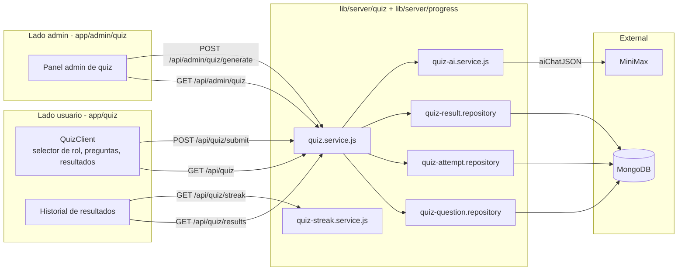
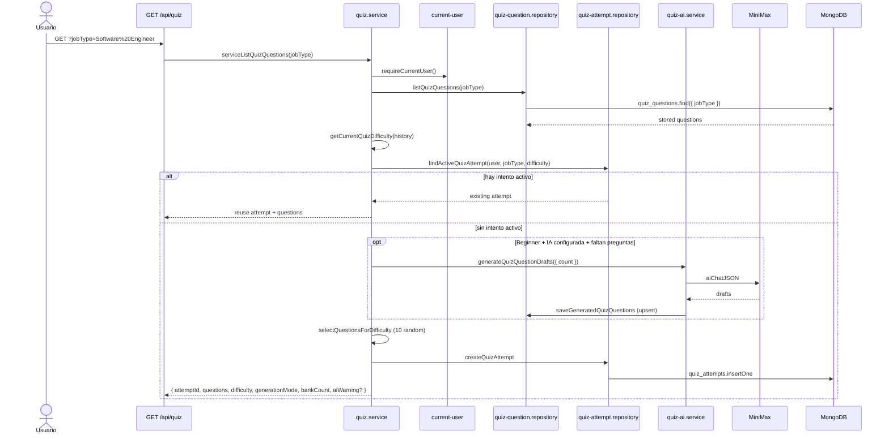
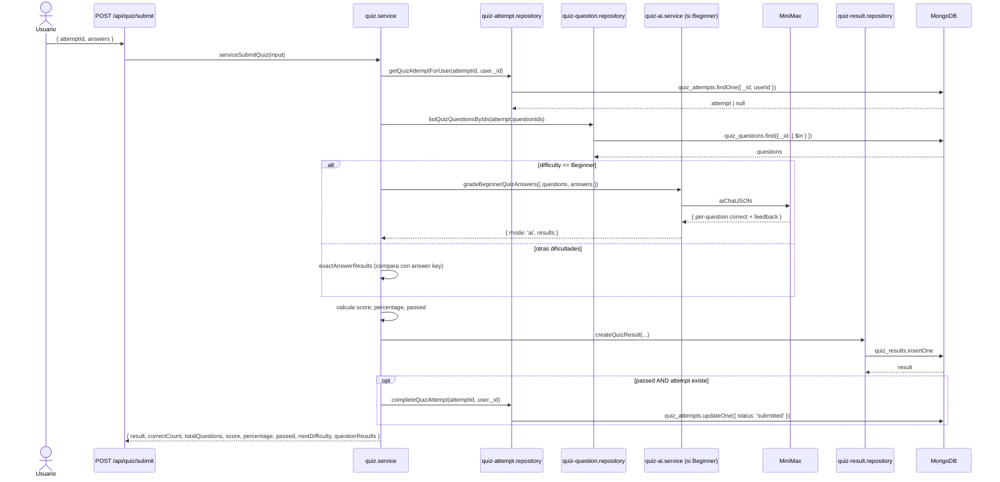
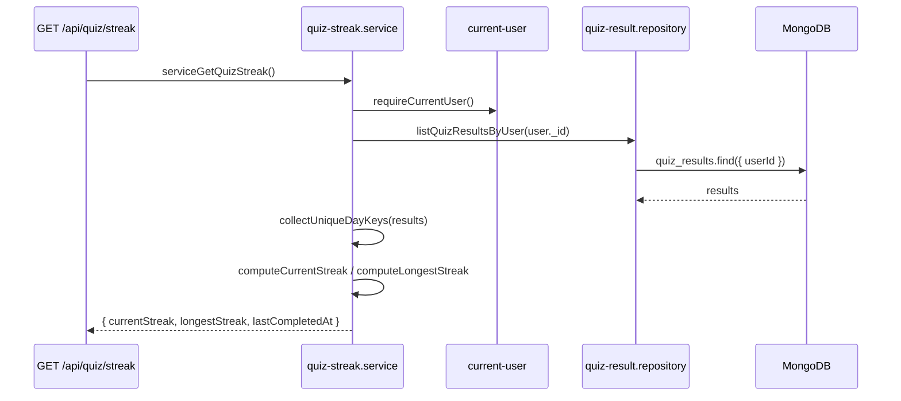
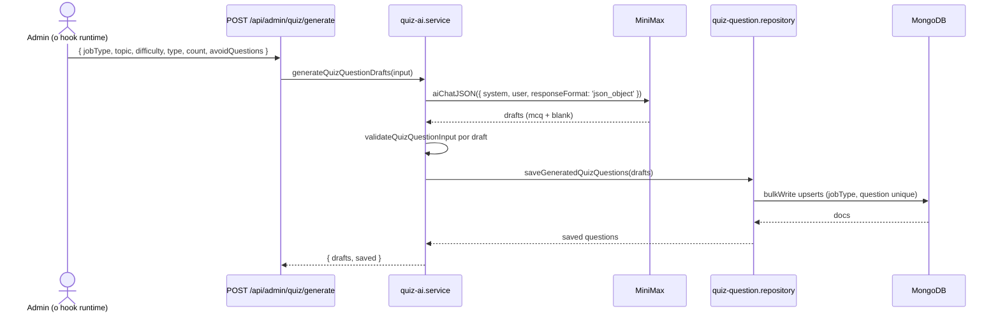

# Quiz

El módulo Quiz es el motor de orientación de Career Forge. Ayuda a los usuarios a descubrir qué roles les quedan mejor a través de intentos cortos de preguntas específicas por rol, con dificultad escalonada. Los admins curan el banco de preguntas; la IA puede completarlo on-demand cuando el catálogo queda corto.

## Vista general



## Roles y dificultades

- **48 roles** soportados (ver `lib/quiz/job-role-catalog.js`).
- **3 dificultades**: `Beginner`, `Intermediate`, `Advanced`.
- **10 preguntas por quiz** (`QUESTIONS_PER_QUIZ` en `quiz.service.js`).
- **Puntaje de aprobación**: 70% (`passed = percentage >= 70`).

La siguiente dificultad del usuario se calcula a partir de su historial de aprobaciones para ese `jobType`:

```js
// lib/server/quiz/quiz.service.js
if (passedDifficulties.has('Advanced') || passedDifficulties.has('Intermediate')) return 'Advanced'
if (passedDifficulties.has('Beginner')) return 'Intermediate'
return 'Beginner'
```

Si aprueba el nivel actual **y** hay al menos 10 preguntas disponibles para el siguiente, avanza automáticamente.

## Banco de preguntas

Cada pregunta pertenece a un `jobType` y una `difficulty`. El origen es `manual` (sembrada) o `ai` (generada).

Controles del banco (forzados por el seeder `npm run seed:quiz:ai` y por el generador en runtime):

- **Target por rol**: 30 preguntas Beginner.
- **Tope absoluto por rol**: 40 preguntas Beginner.
- **Target de catálogo**: 1.440 preguntas Beginner (48 × 30).
- **Tope de catálogo**: 1.920 preguntas Beginner (48 × 40).

Índices (`lib/db/models/quiz-question.js`):

- `{ jobType: 1 }` — filtro por rol.
- `{ jobType: 1, question: 1 }` unique — dedup por texto por rol.

Ver [`../data-model/quiz-question.md`](../data-model/quiz-question.md) para el esquema completo.

## Iniciar un quiz

`GET /api/quiz?jobType=<rol>` ejecuta `serviceListQuizQuestions(jobType)`. El flujo:



Puntos clave:

- La respuesta **nunca incluye las respuestas correctas** (`toPublicQuestions` quita `answer`).
- Si el usuario ya tiene un intento activo, se reutiliza (carga idempotente).
- En `Beginner`, si hay menos de 10 preguntas, la IA puede completar hasta el tope (40 por rol).
- Si la generación IA falla, el usuario recibe el quiz con las preguntas almacenadas disponibles; se devuelve un string `aiWarning`.

## Enviar un quiz

`POST /api/quiz/submit { attemptId, answers }` ejecuta `serviceSubmitQuiz(input)`.



Reglas de scoring:

- Score = `sum(marks de preguntas correctas)`.
- Percentage = `score / totalMarks * 100`.
- `passed` si percentage ≥ 70.
- `gradingMode` es `'ai'` para Beginner (cuando el grading IA funciona) y `'answer-key'` en caso contrario.
- `feedback` es un mensaje corto basado en buckets de percentage.

Si el usuario aprobó el nivel actual y el siguiente nivel tiene 10+ preguntas, `nextDifficulty` avanza.

## Modos de grading

| Dificultad | Grading | Por qué |
|---|---|---|
| Beginner | IA (`gradeBeginnerQuizAnswers`) | Permite preguntas cortas y fill-in-the-blank que requieren juicio semántico. |
| Intermediate / Advanced | Answer-key (`exactAnswerResults`) | Más rápido, offline-capable, determinista para MCQ. |

Si el provider IA no está disponible en Beginner, el servicio **cae a answer-key** para nunca bloquear al usuario.

## Streak

`GET /api/quiz/streak` ejecuta `serviceGetQuizStreak()` (`lib/server/progress/quiz-streak.service.js`).

Dos rachas se calculan a partir de `quiz_results.completedAt`:

- **`currentStreak`** — días UTC consecutivos terminando hoy (o ayer). Si el usuario no jugó hoy ni ayer, la racha es 0.
- **`longestStreak`** — la corrida consecutiva más larga de días UTC en el historial del usuario.



## Pipeline de generación IA (admin / on-demand)

`POST /api/admin/quiz/generate` ejecuta `serviceGenerateQuizQuestions(input)` → `generateQuizQuestionDrafts` → `saveGeneratedQuizQuestions`.



El system prompt fuerza un shape JSON estricto (`{ questions: [...] }`), MCQs con una sola respuesta correcta, y redacción sin sesgos. `avoidQuestions` permite pasar texto de preguntas existentes para que el generador no repita.

El bulk upsert usa `filter: { jobType, question }` para que el mismo texto en el mismo rol **nunca se duplique**.

## Endpoints de admin

| Endpoint | Método | Propósito |
|---|---|---|
| `/api/admin/quiz` | GET | Listar todas las preguntas del banco. |
| `/api/admin/quiz/generate` | POST | Generar nuevas preguntas vía IA y upsert. |

Todos los endpoints admin de quiz requieren `requireAdminUser()`.

## Modelo de datos relacionado

- [`quiz_questions`](../data-model/quiz-question.md) — banco.
- [`quiz_attempts`](../data-model/quiz-attempt.md) — intentos activos.
- [`quiz_results`](../data-model/quiz-result.md) — resultados históricos.

## Ver también

- [`../architecture/data-flow.md`](../architecture/data-flow.md#5-quiz-start--submit--grading) — el sequence principal.
- `lib/quiz/job-role-catalog.js` — el catálogo de 48 roles.
- `scripts/seed-quiz-ai.mjs` — seeder IA bulk.