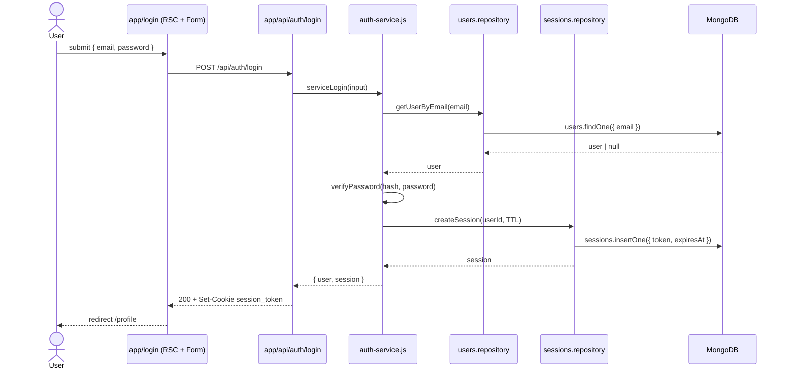
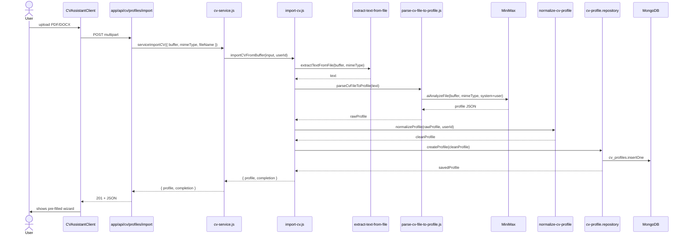
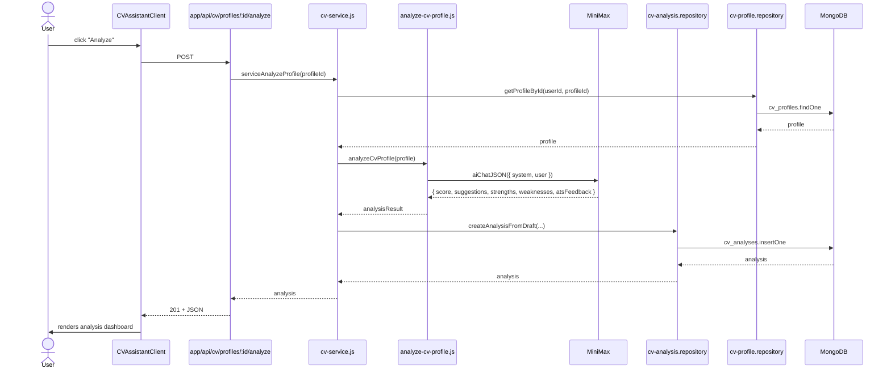
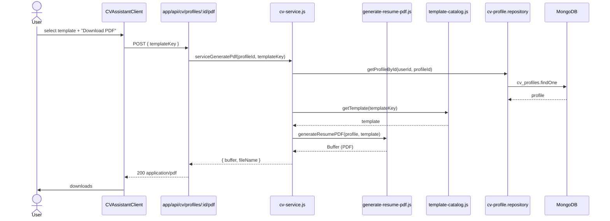
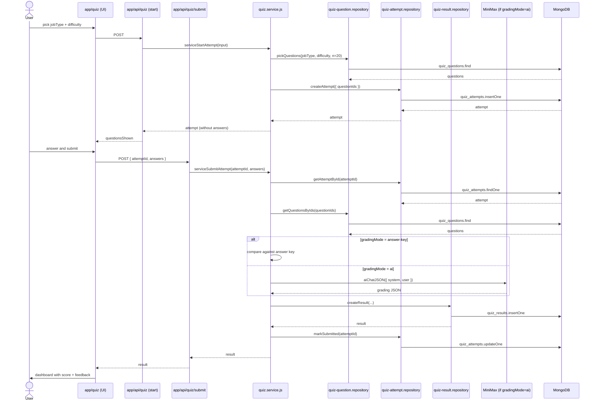
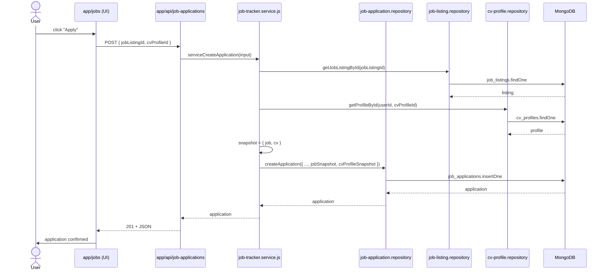
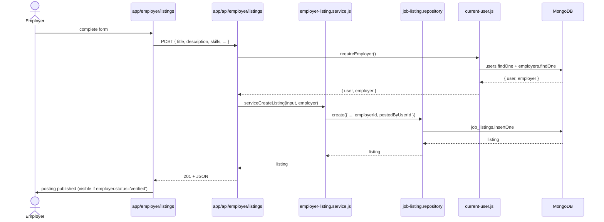
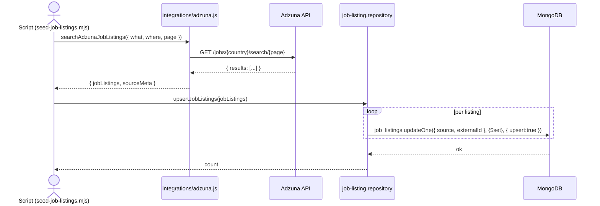

# Key data flows

Sequence diagrams for the most important flows. Each one shows external actors (browser, AI, Adzuna) and the internal modules crossed.

## Index

1. [Login](#1-login)
2. [CV generation — import from file](#2-cv-import-from-file)
3. [AI analysis of a CV](#3-ai-analysis-of-a-cv)
4. [CV PDF generation](#4-cv-pdf-generation)
5. [Quiz: start → submit → grading](#5-quiz-start--submit--grading)
6. [Job application: apply to posting](#6-job-application-apply-to-posting)
7. [Employer: publish posting](#7-employer-publish-posting)
8. [Import postings from Adzuna](#8-import-postings-from-adzuna)

---

## 1. Login

Notes:
- Cookie is `HttpOnly`, `SameSite=Lax`. Expiration is handled by MongoDB with a TTL index on `sessions.expiresAt`.
- `getCurrentUserFromRequest()` (in `lib/server/auth/current-user.js`) runs in every parent RSC to hydrate the header.

---

## 2. CV import from file

If the AI provider fails, the import falls back to `parse-cv-text-to-profile.js` (parser without AI) and degrades gracefully.

---

## 3. AI analysis of a CV

The `gradingMode` field defaults to `'ai'`. `'rule-based'` is reserved as a fallback when no API key is available.

---

## 4. CV PDF generation

The PDF is assembled with `pdf-lib` (`devDependencies`). Not stored on disk; streamed to the client.

---

## 5. Quiz: start → submit → grading

Notes:
- The question bank is capped at 40/role (see [`quiz-question.md`](../data-model/quiz-question.md)).
- If the AI fails, `quiz.service.js` falls back to answer-key grading.

---

## 6. Job application: apply to posting

Notes:
- The snapshots (`jobSnapshot`, `cvProfileSnapshot`) freeze the posting and the CV at the moment of application. If the employer edits the posting afterwards, the applicant still sees the original.
- Status changes drive side-effects: updating `lastActivityAt`, optionally creating a `calendar_event`.

---

## 7. Employer: publish posting

Only employers with `status='verified'` see their postings as active. `pending` and `suspended` keep them in draft.

---

## 8. Import postings from Adzuna

Notes:
- The unique sparse index `{ source: 1, externalId: 1 }` guarantees dedup.
- If `ADZUNA_APP_ID` / `ADZUNA_APP_KEY` are missing, `isAdzunaConfigured()` returns `false` and the UI shows "Import disabled".
- The seeder (`scripts/seed-job-listings.mjs`) is safe to re-run: only upserts.

---

## Cross-cutting patterns summary

| Pattern | Where |
|---|---|
| Service + Repository | `lib/<feature>/server/<feature>.service.js` + `*.repository.js` |
| AI via abstraction | `lib/services/ai.js` (`aiChat`, `aiChatJSON`, `aiAnalyzeFile`) |
| Soft delete | `deletedAt` (users, job_applications) + `isArchived` (job_applications) |
| Immutable snapshot | `job_applications.jobSnapshot` + `cvProfileSnapshot` |
| Automatic TTL | `sessions.expiresAt` with TTL index |
| Answer-key fallback | `quiz.service.js` when AI fails |