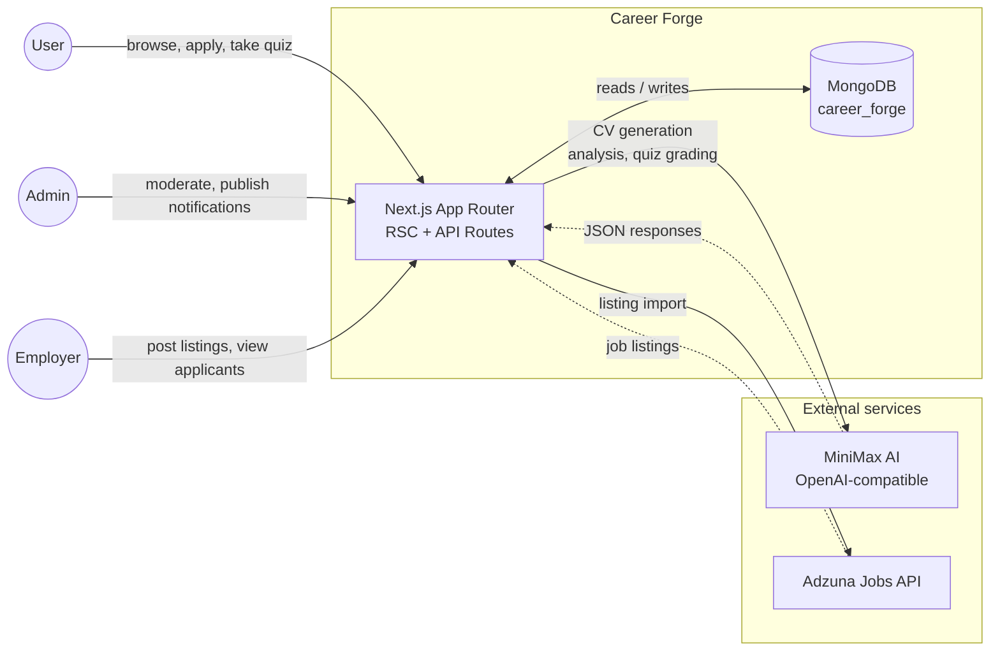
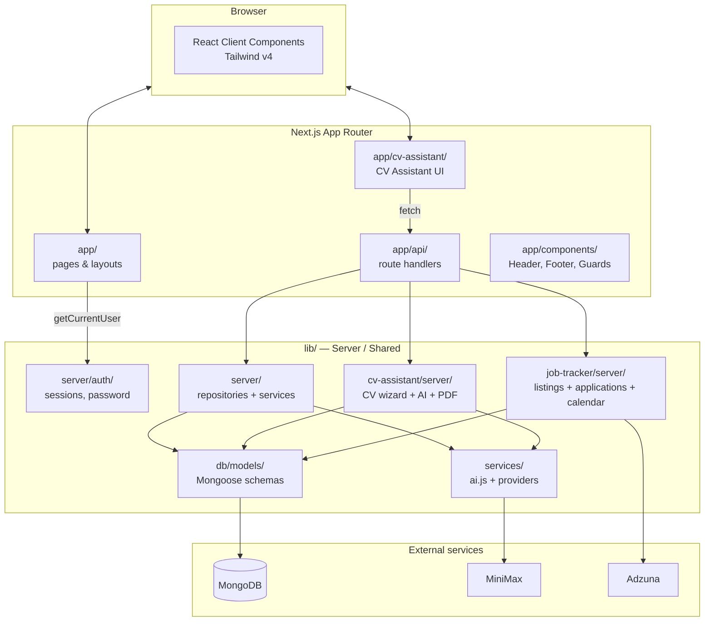

# Architecture overview

Career Forge is a **Next.js (App Router) full-stack** application with hybrid rendering (RSC + Client Components), MongoDB persistence, and external AI services. This page documents the first two levels of the C4 model adapted to the project.

## Level 1 — System view

### Actors

- **User** — a person who registers to use the platform. Creates CVs, takes quizzes, applies to postings.
- **Admin** — moderator with access to `/admin/*`. Manages users, notifications, employers, and support tickets.
- **Employer** — user with `employer` role linked to an `employers` document. Posts listings and reviews applicants.

### External systems

- **MiniMax AI** (`https://api.minimax.io/v1`) — LLM provider compatible with the OpenAI API. Used by `lib/services/ai/providers/minimax.js`. Configurable via `MINIMAX_API_KEY`, `MINIMAX_BASE_URL`, `MINIMAX_MODEL`.
- **Adzuna** (`https://api.adzuna.com`) — job aggregator. Only used if `ADZUNA_APP_ID` + `ADZUNA_APP_KEY` are configured.

## Level 2 — Container / module view

### Responsibilities per container

| Container | Folder | Responsibility |
|---|---|---|
| **Pages** | `app/<feature>/page.jsx` | Server-rendered routes. Load data via `lib/server/*` and pass props to client components. |
| **API Routes** | `app/api/<feature>/route.js` | HTTP endpoints. Validate input, call services, serialise response. Always thin. |
| **Components** | `app/components/` | Header, Footer, SessionAccessGuard, ToolPreviewCarousel. Shared across pages. |
| **CV Assistant UI** | `app/cv-assistant/` | Client wizard (wizard steps, forms, preview). Consumes `/api/cv/*`. |
| **Server auth** | `lib/server/auth/` | Sessions (cookie + Mongo), password hashing, current-user helpers. |
| **Services (AI)** | `lib/services/` | Abstraction layer over the LLM provider (MiniMax). Token usage tracking. |
| **Models** | `lib/db/models/` | Mongoose schemas. The lowest data-access layer. |
| **Repositories / Services** | `lib/server/`, `lib/job-tracker/server/` | Business logic. Per feature: a `<feature>.service.js` (orchestration) + repos per collection. |
| **CV Assistant server** | `lib/cv-assistant/server/` | Server-side wizard: import, parsing, AI analysis, PDF generation. |
| **Job Tracker server** | `lib/job-tracker/server/` | Listings, applications, calendar events. Integrates with Adzuna. |

## Architectural rules

1. **Routes are thin**: logic lives in `lib/*/server/*.service.js`. Routes only validate, call the service, and serialise.
2. **Models are the data boundary**: nobody queries MongoDB directly outside `*.repository.js` (except seeds).
3. **AI is accessed via `aiChat` / `aiChatJSON`**: never call OpenAI directly.
4. **Server-only**: files in `lib/server/**` and `app/api/**` are never imported from Client Components.
5. **Mock auth, ready for Firebase**: `lib/cv-assistant/server/auth/get-current-user-id.js` returns `MOCK_USER_ID`. To integrate real Firebase, replace that function. The rest of the system stays unchanged.
6. **Strict mode off on models**: Mongoose is configured with `strict: false` to allow schema evolution without explicit migrations. Repositories are responsible for normalising before writing.

## Environment variables

| Variable | Default | Purpose |
|---|---|---|
| `MONGODB_URI` | `mongodb://127.0.0.1:27017` | MongoDB connection. |
| `MONGODB_DB` | `career_forge` | Database name. |
| `MINIMAX_API_KEY` | — | Provider API key. |
| `MINIMAX_BASE_URL` | `https://api.minimax.io/v1` | Provider base URL. |
| `MINIMAX_MODEL` | `MiniMax-M2.7` | Default model. |
| `ADZUNA_APP_ID` | — | Adzuna App ID. If missing, import is disabled. |
| `ADZUNA_APP_KEY` | — | Adzuna App key. |
| `ADZUNA_COUNTRY` | `gb` | Adzuna index country. |
| `AI_PROVIDER` | `minimax` | Provider name (only `minimax` supported today). |

## See also

- [`data-flow.md`](data-flow.md) — sequence diagrams for the key flows.
- [`../data-model/collections.md`](../data-model/collections.md) — data model.
- [`../features/cv-assistant.md`](../features/cv-assistant.md), [`../features/job-tracker.md`](../features/job-tracker.md) — specific features.