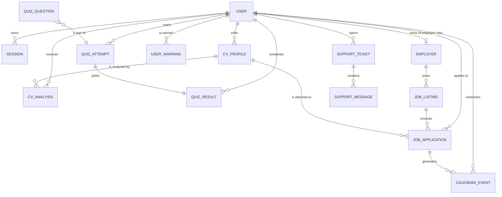

# Data model — Collections index

Career Forge persists all data in **MongoDB** (default database: `career_forge`). Definitions live in `lib/db/models/*.js` and are compiled with Mongoose in `strict: false` mode, which means each model declares typed fields but does not reject documents with extra fields.

## Conventions

- **IDs**: models reference other documents using `Mixed` (24-char hexadecimal ObjectId string). The helper `lib/server/object-id.js` normalises string ↔ `ObjectId`.
- **Dates**: stored as **ISO-8601 strings** (`new Date().toISOString()`), not as native `Date`. This avoids serialization issues between RSC and client.
- **Timestamps**: every document carries `createdAt` / `updatedAt` (ISO-8601 string). Repositories are responsible for keeping them in sync.
- **Soft delete**: collections that support logical deletion expose `deletedAt` (ISO string or `null`).
- **Indexes**: each model declares its indexes in the schema. See the summary table below.

## Entity diagram

> 1:N relationships between USER and most collections are materialized by a `userId` field (ObjectId string) on the child document. There is no `JOIN`: queries are performed with `find({ userId })`.

## Collections summary

| Collection | Mongoose model | Typical document | Main indexes |
|---|---|---|---|
| `users` | `lib/db/models/user.js` | User account + basic profile | `email` (unique), `status`, `role` |
| `sessions` | `lib/db/models/session.js` | Active session with cookie token | `token` (unique), `expiresAt` (TTL) |
| `employers` | `lib/db/models/employer.js` | Registered company | `ownerUserId`, `status` |
| `cv_profiles` | `lib/db/models/cv-profile.js` | Editable CV profile | `userId+updatedAt`, `userId+isDefault` |
| `cv_analyses` | `lib/db/models/cv-analysis.js` | Result of an AI CV analysis | `userId+profileId+createdAt` |
| `quiz_questions` | `lib/db/models/quiz-question.js` | Question in the bank (multi-role) | `jobType`, `jobType+question` (unique) |
| `quiz_attempts` | `lib/db/models/quiz-attempt.js` | In-progress quiz attempt | `userId+jobType+difficulty+status+createdAt` |
| `quiz_results` | `lib/db/models/quiz-result.js` | Historical quiz result | `userId+completedAt`, `userId+jobType+completedAt` |
| `job_listings` | `lib/db/models/job-listing.js` | Job posting (manual or imported) | `isActive+updatedAt`, `category+isActive`, `requiredSkills`, `source+externalId` (unique sparse), `postedByUserId` |
| `job_applications` | `lib/db/models/job-application.js` | User application | `userId+deletedAt+isArchived+updatedAt`, `userId+jobListingId`, `userId+cvProfileId` |
| `calendar_events` | `lib/db/models/calendar-event.js` | Calendar event | `userId+eventDate`, `userId+jobApplicationId` |
| `notifications` | `lib/db/models/notification.js` | Global or per-user notification | `audience+isPublished+startsAt`, `audience+targetUserId+isPublished+startsAt`, `createdByUserId+createdAt` |
| `user_warnings` | `lib/db/models/user-warning.js` | Admin-issued warning | `userId+createdAt`, `adminId+createdAt` |
| `support_tickets` | `lib/db/models/support-ticket.js` | Support ticket | `userId+lastMessageAt`, `status+lastMessageAt` |
| `support_messages` | `lib/db/models/support-message.js` | Message within a ticket | `ticketId+createdAt` |

## Key cardinalities

- **1 user → N CV profiles**: a user can have several CVs; one is marked `isDefault=true`.
- **1 CV profile → N analyses**: each AI analysis is tied to the evaluated profile.
- **1 quiz attempt → 1 quiz result**: submitting an attempt creates exactly one result.
- **1 employer → N job listings**: a company publishes N postings.
- **1 job listing → N job applications**: many users can apply to the same posting.
- **1 job application → N calendar events**: each status change / date can spawn events.
- **1 support ticket → N support messages**: append-only conversation.

## Per-collection files

Each collection has an individual file with the full JSON document structure and usage notes:

- [`user.md`](user.md)
- [`session.md`](session.md)
- [`employer.md`](employer.md)
- [`cv-profile.md`](cv-profile.md)
- [`cv-analysis.md`](cv-analysis.md)
- [`quiz-question.md`](quiz-question.md)
- [`quiz-attempt.md`](quiz-attempt.md)
- [`quiz-result.md`](quiz-result.md)
- [`job-listing.md`](job-listing.md)
- [`job-application.md`](job-application.md)
- [`calendar-event.md`](calendar-event.md)
- [`notification.md`](notification.md)
- [`user-warning.md`](user-warning.md)
- [`support-ticket.md`](support-ticket.md)
- [`support-message.md`](support-message.md)

## Design notes

### Why `Mixed` instead of `ObjectId`

Reference IDs use `Schema.Types.Mixed` instead of `ObjectId`. This is because **RSC serialization** needs strings, and keeping the coercion in a single layer (`lib/server/object-id.js`) avoids inconsistencies between client and server. The MongoDB index keeps working because internally they are stored as 24-char hexadecimal strings.

### Why dates as strings

Next.js App Router serializes props between RSC and client using `JSON.stringify`. `Date` objects serialise to strings, but when deserialised on the client they become plain strings (not `Date`). Storing dates as **ISO-8601 strings** removes that problem and allows reliable lexicographic comparisons for ordering.

### Soft delete vs hard delete

- `users`, `job_applications`, `job_listings` (via `isActive`): support logical deletion via `deletedAt` or `isActive`.
- All other collections are physically deleted (hard delete) in their repositories.

### TTL on sessions

The `sessions` collection declares a TTL index on `expiresAt` with `expireAfterSeconds: 0`, which causes MongoDB to automatically remove documents when the session expires. No external cron needed.