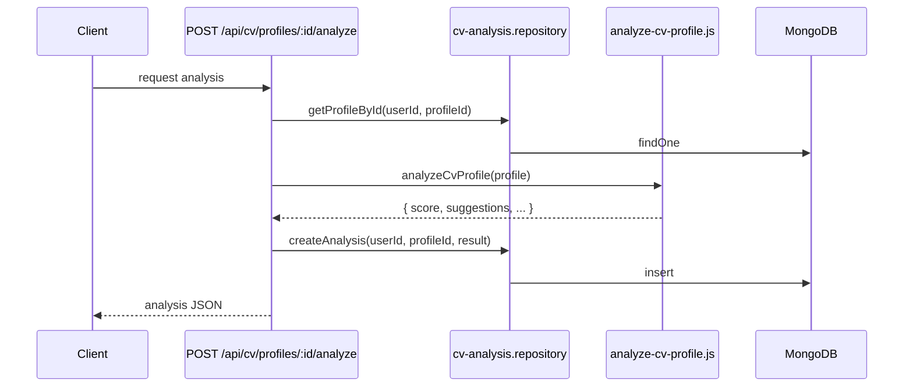

# `cv_analyses`

Result of the AI analysis of a CV profile. Includes ATS (Applicant Tracking System) feedback, overall score, suggestions, strengths, and weaknesses.

**MongoDB collection:** `cv_analyses`
**Mongoose model:** `lib/db/models/cv-analysis.js`
**Exported function:** `getCvAnalysisModel()`

## Document structure

```json
{
  "_id": "ObjectId",
  "userId": "string ObjectId",
  "profileId": "string ObjectId",
  "atsFeedback": "object",
  "overallScore": "number (0-100)",
  "suggestions": "object",
  "strengths": "object",
  "weaknesses": "object",
  "gradingMode": "'ai' | 'rule-based' (default 'ai')",
  "lastEditedByUserId": "string ObjectId | null",
  "lastEditedAt": "string ISO-8601 | null",
  "lastEditedReason": "string | null",
  "createdAt": "string ISO-8601"
}
```

## Fields

| Field | Type | Notes |
|---|---|---|
| `userId` | string | Who requested the analysis. |
| `profileId` | string | Which CV was analysed. |
| `atsFeedback` | object | Structured output of the ATS parser (detected keywords, format, length). |
| `overallScore` | number | 0-100. Computed by AI. |
| `suggestions` | object | Prioritised list of improvements. |
| `strengths` | object | List of detected strengths. |
| `weaknesses` | object | List of detected weaknesses. |
| `gradingMode` | string | `'ai'` by default. Reserved for rule-based fallback. |
| `lastEditedByUserId` / `lastEditedAt` / `lastEditedReason` | various | Audit trail when an admin manually edits the feedback. |

## Indexes

- `{ userId: 1, profileId: 1, createdAt: -1 }` (`cv_analysis_user_profile_created`).

## Relationships

- **N:1 → `users`**.
- **N:1 → `cv_profiles`**.

## Generation flow



More detail in [`features/cv-assistant.md`](../features/cv-assistant.md).

## See also

- [`cv-profile.md`](cv-profile.md)
- [`features/cv-assistant.md`](../features/cv-assistant.md)