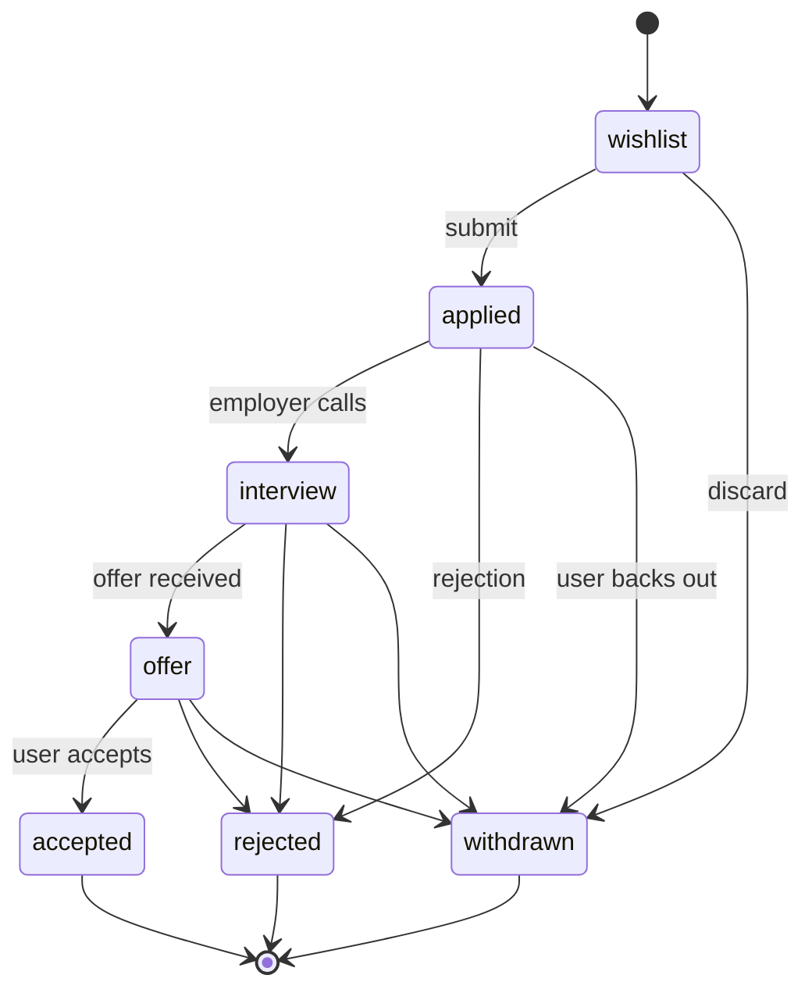

# `job_applications`

User application to a posting. Saves snapshots of the CV and of the posting at the moment of application (so history stays stable even if the posting changes).

**MongoDB collection:** `job_applications`
**Mongoose model:** `lib/db/models/job-application.js`
**Exported function:** `getJobApplicationModel()`

## Document structure

```json
{
  "_id": "ObjectId",
  "userId": "string ObjectId",
  "jobListingId": "string ObjectId | null",
  "jobSnapshot": "object",
  "cvProfileId": "string ObjectId",
  "cvProfileSnapshot": "object",
  "status": "'wishlist' | 'applied' | 'interview' | 'offer' | 'rejected' | 'accepted' | 'withdrawn'",
  "previousStatus": "string | null",
  "appliedAt": "string ISO-8601 | null",
  "lastActivityAt": "string ISO-8601",
  "promisedResponseDate": "string ISO-8601 | null",
  "notes": "string",
  "adaptedDescription": "string",
  "isArchived": "boolean (default false)",
  "archivedAt": "string ISO-8601 | null",
  "archivedReason": "string | null",
  "deletedAt": "string ISO-8601 | null",
  "createdAt": "string ISO-8601",
  "updatedAt": "string ISO-8601"
}
```

## Fields

| Field | Type | Notes |
|---|---|---|
| `userId` | string | Who applied. |
| `jobListingId` | string | FK to `job_listings._id`. Can be `null` if the external posting was deleted. |
| `jobSnapshot` | object | Immutable copy of the posting at the moment of application. Allows stable history. |
| `cvProfileId` | string | Submitted CV. |
| `cvProfileSnapshot` | object | Copy of the CV. |
| `status` | enum | State in the user's pipeline. |
| `previousStatus` | string | Previous state (to detect transitions and trigger events). |
| `appliedAt` | string | When it transitioned to `applied`. |
| `lastActivityAt` | string | Last interaction (status change, note, etc.). |
| `promisedResponseDate` | string | If the employer gave an SLA, when they promised to respond. |
| `notes` | string | Free-form user notes. |
| `adaptedDescription` | string | Posting description adapted (optionally AI-generated). |
| `isArchived` / `archivedAt` / `archivedReason` | various | Soft archive (user decides to hide). |
| `deletedAt` | string | Soft delete. |

## States (`status`)



## Indexes

- `{ userId: 1, deletedAt: 1, isArchived: 1, updatedAt: -1 }` (`job_applications_user_state_updated`).
- `{ userId: 1, jobListingId: 1 }` (`job_applications_user_listing`).
- `{ userId: 1, cvProfileId: 1 }` (`job_applications_user_cv_profile`).

## Snapshots: why they matter

If an employer edits a posting after a user has applied, `jobSnapshot` freezes the text that the candidate saw. Same with the CV: the user can update their CV without retroactively changing the one sent for posting X.

## Relationships

- **N:1 → `users`**.
- **N:1 → `job_listings`** (logical).
- **N:1 → `cv_profiles`**.
- **1:N → `calendar_events`** (status changes schedule events).

## See also

- [`job-listing.md`](job-listing.md)
- [`cv-profile.md`](cv-profile.md)
- [`calendar-event.md`](calendar-event.md)
- [`features/job-tracker.md`](../features/job-tracker.md)