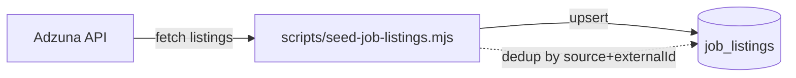

# `job_listings`

Job postings on the platform. Can be **internal** (published by an employer) or **external** (imported from Adzuna or another source).

**MongoDB collection:** `job_listings`
**Mongoose model:** `lib/db/models/job-listing.js`
**Exported function:** `getJobListingModel()`

## Document structure

```json
{
  "_id": "ObjectId",
  "source": "'internal' | 'adzuna' | 'manual'",
  "externalId": "string | null",
  "title": "string",
  "company": "string",
  "location": "string",
  "description": "string",
  "salaryMin": "number | null",
  "salaryMax": "number | null",
  "url": "string | null",
  "requiredSkills": "string[]",
  "category": "string",
  "employmentType": "'full_time' | 'part_time' | 'contract' | 'internship' | 'temporary' | 'freelance' | 'other' | null",
  "postedAt": "string ISO-8601 | null",
  "isActive": "boolean (default true)",
  "postedByUserId": "string ObjectId | null",
  "employerId": "string ObjectId | null",
  "createdAt": "string ISO-8601",
  "updatedAt": "string ISO-8601"
}
```

## Fields

| Field | Type | Notes |
|---|---|---|
| `source` | string | Origin of the posting. Defines how it is updated. |
| `externalId` | string | ID in the external system (e.g. Adzuna). Unique together with `source` (unique sparse index). |
| `title` | string | Job title. |
| `company` | string | Displayed company name. |
| `location` | string | City / region / "Remote". |
| `description` | string | Full text (HTML or markdown depending on the source). |
| `salaryMin` / `salaryMax` | number | Annual salary range. |
| `url` | string | External URL to apply (only if `source != 'internal'`). |
| `requiredSkills` | string[] | Skills extracted from the text. Used for matching. |
| `category` | string | Grouping category (technology, health, retail, etc.). |
| `employmentType` | enum | Contract type. |
| `postedAt` | string | When originally posted. |
| `isActive` | boolean | `false` = closed/expired posting, not visible. |
| `postedByUserId` | string | If published internally, who created it. |
| `employerId` | string | FK to `employers._id` (if `source == 'internal'`). |

## Indexes

- `{ isActive: 1, updatedAt: -1 }` (`job_listings_active_updated`) — main feed.
- `{ category: 1, isActive: 1 }` (`job_listings_category_active`) — category filter.
- `{ requiredSkills: 1 }` (`job_listings_required_skills`) — multikey for skill search.
- `{ source: 1, externalId: 1 }` unique sparse (`job_listings_source_external_id`) — import dedup.
- `{ postedByUserId: 1 }` (`job_listings_posted_by`).

## Relationships

- **N:1 → `employers`** (if `source == 'internal'`).
- **N:1 → `users`** (via `postedByUserId`, if published by an employer-owner).
- **1:N → `job_applications`**.

## Import flow



## See also

- [`job-application.md`](job-application.md)
- [`employer.md`](employer.md)
- [`features/job-tracker.md`](../features/job-tracker.md)