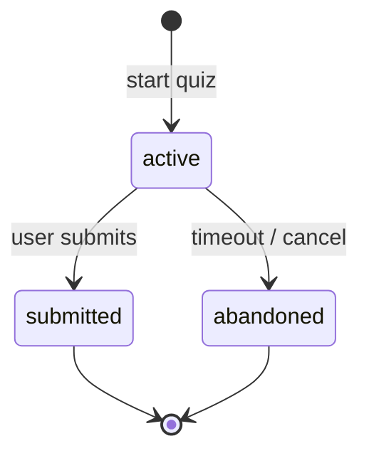

# `quiz_attempts`

Active (or historical) quiz attempt. Created when starting a quiz and marked `submitted` when the user sends answers. An attempt generates **exactly one** `quiz_result`.

**MongoDB collection:** `quiz_attempts`
**Mongoose model:** `lib/db/models/quiz-attempt.js`
**Exported function:** `getQuizAttemptModel()`

## Document structure

```json
{
  "_id": "ObjectId",
  "userId": "string ObjectId (required)",
  "jobType": "string (required)",
  "difficulty": "string (required)",
  "questionIds": "string[] (ObjectId[])",
  "status": "'active' | 'submitted' | 'abandoned' (default 'active')",
  "generationMode": "'bank' | 'ai' (default 'bank')",
  "createdAt": "string ISO-8601 (required)",
  "updatedAt": "string ISO-8601 (required)",
  "submittedAt": "string ISO-8601 | null"
}
```

## Fields

| Field | Type | Notes |
|---|---|---|
| `userId` | string | Who is answering. |
| `jobType` | string | Chosen role. |
| `difficulty` | string | Level. |
| `questionIds` | ObjectId[] | IDs of assigned questions. Frozen on attempt creation. |
| `status` | string | `active` (in progress), `submitted` (answered), `abandoned` (expired). |
| `generationMode` | string | `bank` (from the bank) or `ai` (generated on demand). |
| `submittedAt` | string \| null | Submission timestamp. |

## Indexes

- `{ userId: 1, jobType: 1, difficulty: 1, status: 1, createdAt: -1 }` (`quiz_attempts_user_role_level_status`).

## Lifecycle



## Relationships

- **N:1 → `users`**.
- **N:M → `quiz_questions`** via `questionIds`.
- **1:1 → `quiz_results`** (one per submitted attempt).

## See also

- [`quiz-question.md`](quiz-question.md)
- [`quiz-result.md`](quiz-result.md)