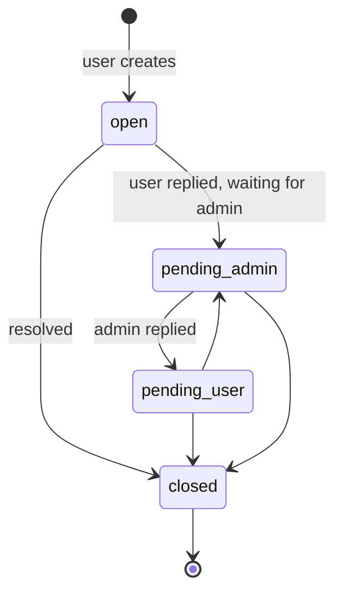

# `support_tickets`

Support ticket opened by a user. The conversation lives in `support_messages`.

**MongoDB collection:** `support_tickets`
**Mongoose model:** `lib/db/models/support-ticket.js`
**Exported function:** `getSupportTicketModel()`

## Document structure

```json
{
  "_id": "ObjectId",
  "userId": "string ObjectId",
  "subject": "string",
  "status": "'open' | 'pending_user' | 'pending_admin' | 'closed' (default 'open')",
  "lastMessageAt": "string ISO-8601",
  "lastMessageBy": "'user' | 'admin'",
  "createdAt": "string ISO-8601",
  "updatedAt": "string ISO-8601"
}
```

## Fields

| Field | Type | Notes |
|---|---|---|
| `userId` | string | Who opened it. |
| `subject` | string | Short summary. |
| `status` | string | Flow state. |
| `lastMessageAt` | string | For inbox sorting. |
| `lastMessageBy` | string | Who wrote last (defines whose turn it is to reply). |

## Indexes

- `{ userId: 1, lastMessageAt: -1 }` (`support_tickets_user_lastMessage`).
- `{ status: 1, lastMessageAt: -1 }` (`support_tickets_status_lastMessage`).

## States



## Relationships

- **N:1 → `users`**.
- **1:N → `support_messages`**.

## See also

- [`support-message.md`](support-message.md)
- `features/admin.md` *(next iteration)*