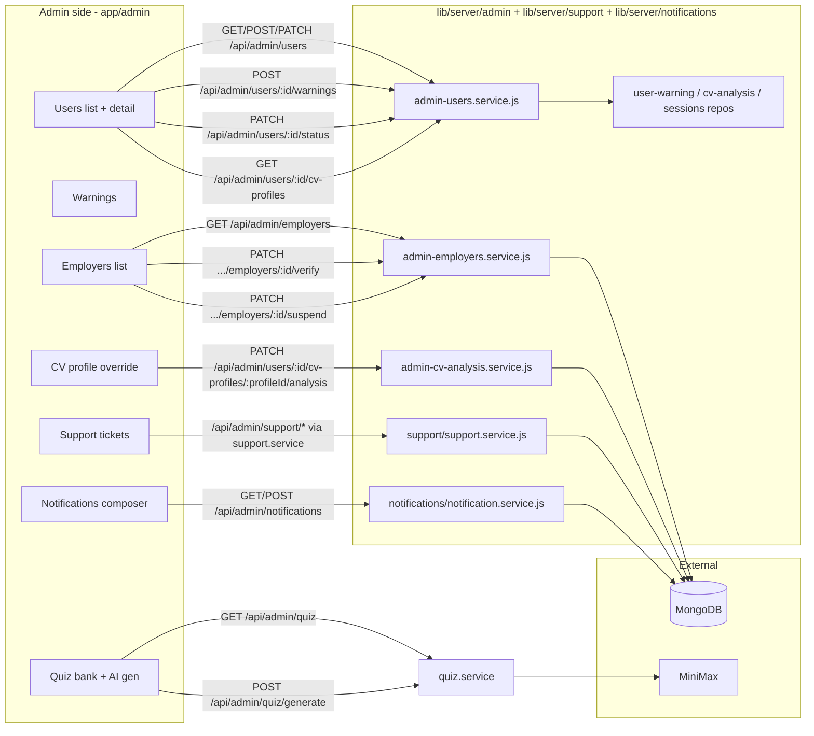
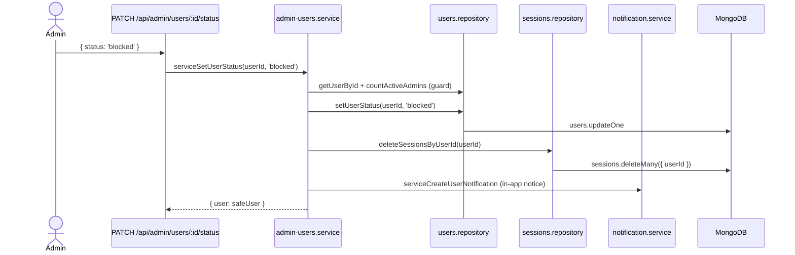
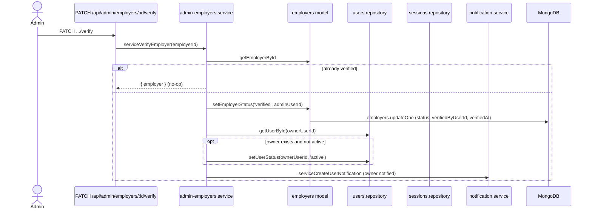
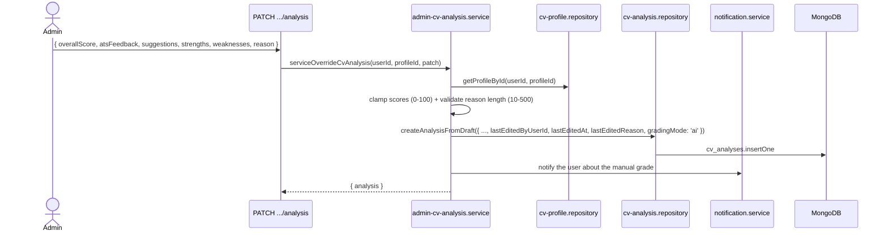

# Admin

The Admin module gives moderators full operational control over Career Forge: user management (status, warnings, lifecycle), employer verification/suspension, manual CV-analysis overrides, support-ticket triage, and platform-wide notifications.

## Overview

Every admin route handler delegates to a service in `lib/server/admin/`. Every service starts with `await requireAdminUser()`.

## User management

Lives in `lib/server/admin/admin-users.service.js`.

### List users

`GET /api/admin/users?status=&role=&search=&page=`

- Filters: `status`, `role`, free-text `search` (email/name).
- Pagination: `page`, `pageSize` (default 10, max 100).
- Returns `{ users, page, pageSize, total, totalPages }`.

### Create user

`POST /api/admin/users { firstName, lastName, email, password, role }` — admin creates a user directly. Hashes the password with the same helper as public registration.

### View user detail

`GET /api/admin/users/:userId` — returns:

- Safe user (no `passwordHash`).
- Their CV profile summaries.
- Latest CV analysis per profile.
- Aggregated counts: applications, calendar events, quiz results, warnings, support tickets.

### Change status

`PATCH /api/admin/users/:userId/status { status }`

Allowed transitions: `active`, `blocked`, `deleted`. **An admin cannot demote the last active admin** (`countActiveAdmins > 1` guard). When status changes to `blocked` or `deleted`, all the user's sessions are wiped via `deleteSessionsByUserId`.

### Issue warnings

`POST /api/admin/users/:userId/warnings { message }`

Persists a `user_warnings` document and optionally notifies the user. Warnings accumulate and can be used by support / moderation flows.

### Reactivate / restore

Admins can move a `deleted` or `suspended` user back to `active`. Sessions are not restored (user must log in again).

## Employer verification

`lib/server/admin/admin-employers.service.js` handles the approval workflow.

Suspension (`.../suspend`) is the inverse flow: status flips to `suspended`, the owner's user status flips to `blocked`, all sessions are wiped, and a notification is sent. Their `job_listings` become inactive (via `isActive=false` propagation, owned by the employer service).

## CV-analysis override

`PATCH /api/admin/users/:userId/cv-profiles/:profileId/analysis` runs `serviceOverrideCvAnalysis` (`lib/server/admin/admin-cv-analysis.service.js`).

Allows an admin to manually correct an AI-generated analysis:

This preserves the audit trail (`lastEditedByUserId`, `lastEditedAt`, `lastEditedReason`) while letting admins correct mistakes.

## Notifications

`lib/server/notifications/notification.service.js` powers both admin-broadcast and per-user messages.

| Endpoint | Method | Purpose |
|---|---|---|
| `/api/admin/notifications` | GET | List all notifications (admin). |
| `/api/admin/notifications` | POST | Create + publish. |
| `/api/notifications` | GET | List notifications visible to the current user. |

Notifications have:

- `audience`: `'all' | 'admins' | 'employers' | 'user'`.
- `targetUserId`: required when `audience === 'user'`.
- `startsAt` / `expiresAt`: time window.
- `isPublished`: draft vs live.

A scheduled sweeper (driven by reads with the index `{ audience, isPublished, startsAt }`) hides expired entries.

## Support ticket triage

Admin uses the same `/api/support/tickets` endpoints as users, with extra query params: `status`, `search`, `sort`, `page`, `pageSize`.

`lib/server/support/support.service.js` exposes:

- `serviceListTickets` — admin sees all tickets, paginated.
- `serviceSearchTickets` — full-text over subject/body.
- `serviceGetTicketStats` — counts by status.
- `serviceUpdateTicketStatus` — admin-only status transitions.

See [`../data-model/support-ticket.md`](../data-model/support-ticket.md) and [`../data-model/support-message.md`](../data-model/support-message.md) for the conversation model.

## Permissions

| Role | Can access admin endpoints |
|---|---|
| `user` | No. |
| `employer` (verified or not) | No. |
| `admin` | Yes — all `/api/admin/*` routes. |

Helper: `requireAdminUser()` in `lib/server/auth/current-user.js`.

## Safety rails

The admin service encodes several non-obvious safety rules. They are worth highlighting because they protect users from accidental lock-outs:

1. **Last-admin guard**: cannot demote or delete the last active admin (`countActiveAdmins > 1`).
2. **Self-protection**: an admin cannot demote or delete themselves.
3. **Session wipe**: any status change to `blocked` or `deleted` immediately calls `deleteSessionsByUserId` so the affected user is logged out everywhere.
4. **Audit trail on CV overrides**: `lastEditedByUserId`, `lastEditedAt`, `lastEditedReason` are mandatory; reason must be 10-500 chars.
5. **Employer suspension cascades**: owner user status flips to `blocked`, sessions are wiped, listings become inactive.

## See also

- [`../data-model/user.md`](../data-model/user.md), [`../data-model/user-warning.md`](../data-model/user-warning.md)
- [`../data-model/employer.md`](../data-model/employer.md), [`../data-model/notification.md`](../data-model/notification.md)
- [`../data-model/support-ticket.md`](../data-model/support-ticket.md)
- [`../features/cv-assistant.md`](../features/cv-assistant.md) — manual override targets
- [`../features/job-tracker.md`](../features/job-tracker.md) — employer verification context
- [`../features/quiz.md`](../features/quiz.md) — admin quiz endpoints