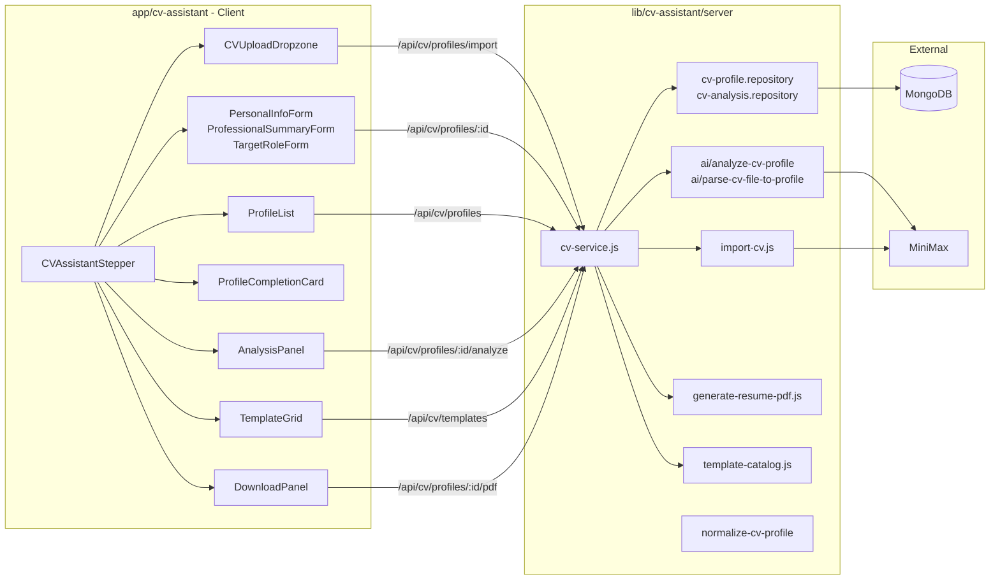
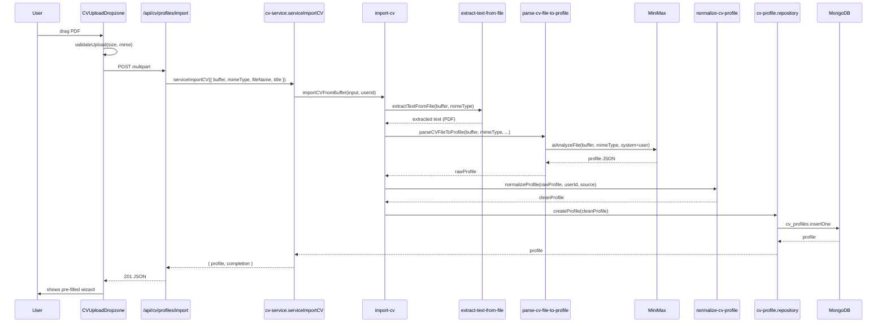
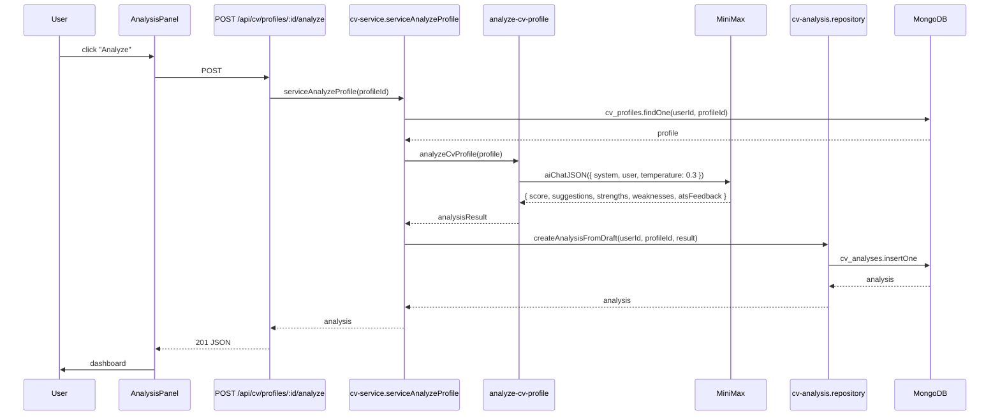
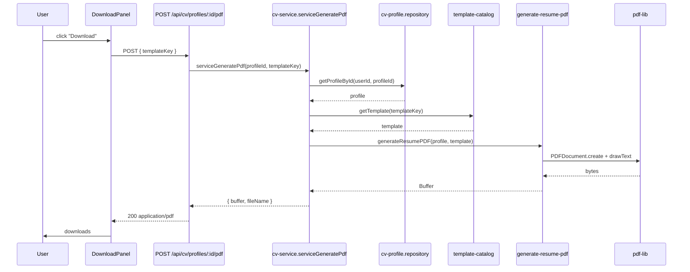

# CV Assistant

The CV Assistant is the richest feature of Career Forge: it lets a user create one or more CV profiles from a PDF, review and edit the information through a wizard, receive AI analysis with ATS feedback, pick among several templates, and download a ready-to-send PDF.

## Overview

## Wizard steps

Defined in `lib/cv-assistant/ui-steps.js`:

| Step | Label | Main component | Endpoint |
|---|---|---|---|
| 01 | Upload & Profiles | `CVUploadDropzone` + `ProfileList` | `POST /api/cv/profiles/import`, `GET /api/cv/profiles` |
| 02 | Review Profile | `PersonalInfoForm`, `ProfessionalSummaryForm`, `TargetRoleForm` | `GET/PATCH /api/cv/profiles/:profileId` |
| 03 | AI Analysis | `AnalysisPanel` | `POST /api/cv/profiles/:profileId/analyze`, `GET /api/cv/profiles/:profileId/analyses` |
| 04 | Templates | `TemplateGrid` | `GET /api/cv/templates`, `POST /api/cv/templates/:key/evaluate` |
| 05 | Download | `DownloadPanel` | `POST /api/cv/profiles/:profileId/pdf` |

## Import pipeline (PDF → profile)

Key points:

- **PDF only**: validation rejects other formats (`UNSUPPORTED_FILE_TYPE`).
- **Buffer is never persisted**: only the structured JSON is saved in `cv_profiles`.
- **Fallback**: if AI fails (`AIServiceError`), it falls back to `parse-cv-text-to-profile.js` (parser without AI) to avoid total blockage.
- **Source tracking**: the `source.type` field is set to `'uploaded_cv'` with `originalFileName`, `originalFileType`, `parsedAt` for audit.

## AI analysis pipeline

What the analysis produces:

- `overallScore` (0-100)
- `atsFeedback` — structured feedback for Applicant Tracking Systems
- `suggestions` — prioritised improvements
- `strengths` / `weaknesses`
- `gradingMode` — `'ai'` by default, `'rule-based'` reserved as fallback

The analysis is persisted in `cv_analyses` with the index `{ userId, profileId, createdAt: -1 }`. The panel shows the latest N analyses.

## CV templates

`lib/cv-assistant/template-catalog.js` declares the catalogue. Every template defines `requiredFields` and `recommendedFields` that are evaluated against the profile.

| Key | Category | Use case |
|---|---|---|
| `harvard-classic` | `classic` | Students, internships, business/finance/consulting. |
| `ats-simple` | `ats` | Online applications, corporate ATS, clarity over design. |
| `reverse-chronological-professional` | `professional` | Clear, ascending trajectory. |
| `technical-projects` | `technical` | Technical roles with weight on projects. |
| `hybrid-combination` | `hybrid` | Combines skills + experience. |

Evaluation: `POST /api/cv/templates/:key/evaluate` runs `evaluateTemplate(profile, template)` and returns:

- `status`: `'available'` | `'recommended'` | `'needs_more_information'` | `'not_recommended'`
- `missingRequired`: list of missing required fields
- `missingRecommended`: list of recommendations

The stepper forces moving to the correct step according to `stepForTemplate(templateKey)`.

## PDF generation

Notes:
- `pdf-lib` (`devDependencies`) is the only PDF dependency.
- The PDF is streamed; never written to server disk.

## Related data model

- [`cv_profile`](../data-model/cv-profile.md) — editable profile with `completion.percent` recalculated on each save.
- [`cv_analysis`](../data-model/cv-analysis.md) — AI analyses persisted per profile.
- Shared types in [`lib/cv-assistant/types.js`](../../lib/cv-assistant/types.js): `SeniorityLevel`, `EmploymentType`, `LanguageProficiency`, `LinkType`, `SourceType`, `AnalysisPriority`, `TemplateStatus`, `TemplateCategory`, `CVTemplateKey`.

## Current auth

`lib/cv-assistant/server/auth/get-current-user-id.js` returns `MOCK_USER_ID`. This enables developing the feature end-to-end without Firebase. For production, see the guide in `AGENTS.md`.

## Tests

- `app/cv-assistant/__tests__/` — UI component tests (Vitest + jsdom).
- `lib/cv-assistant/test/mongo-helpers.js` — helper for integration tests with `MongoMemoryServer`.
- `lib/cv-assistant/server/*.test.js` — service, repo and AI mock tests.

## See also

- [`../architecture/data-flow.md`](../architecture/data-flow.md#2-cv-import-from-file)
- [`../architecture/data-flow.md`](../architecture/data-flow.md#3-ai-analysis-of-a-cv)
- [`../architecture/data-flow.md`](../architecture/data-flow.md#4-cv-pdf-generation)