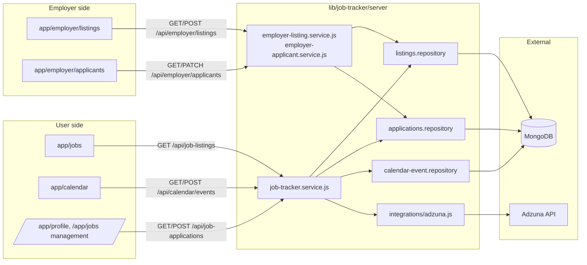
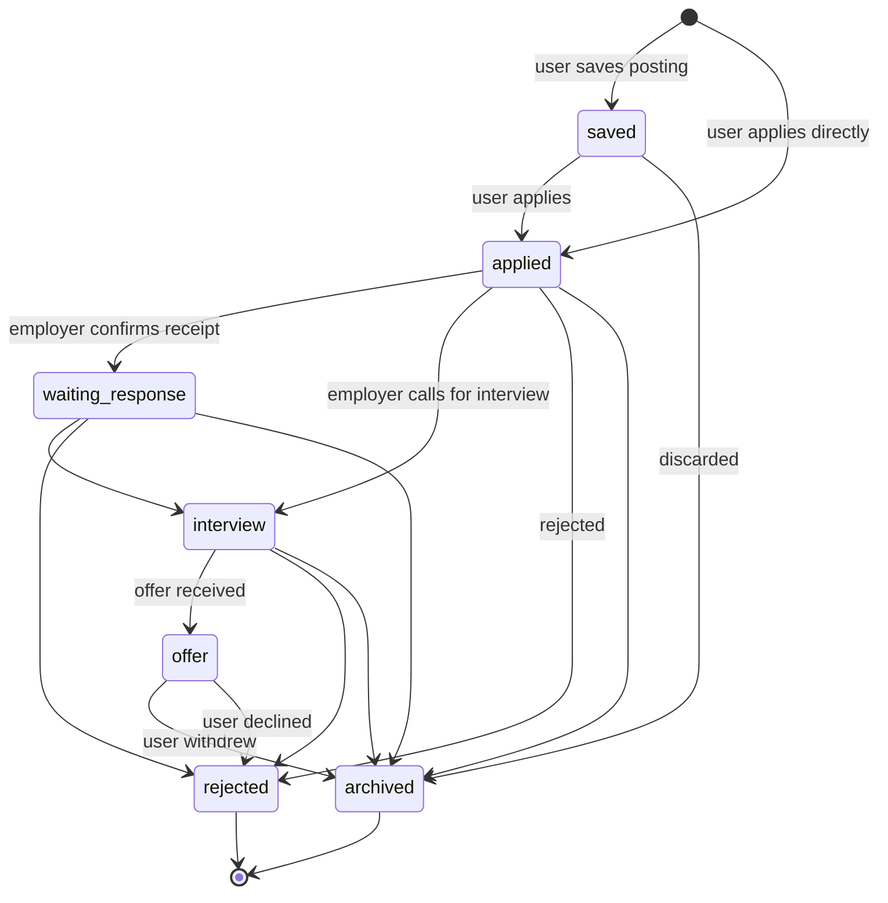
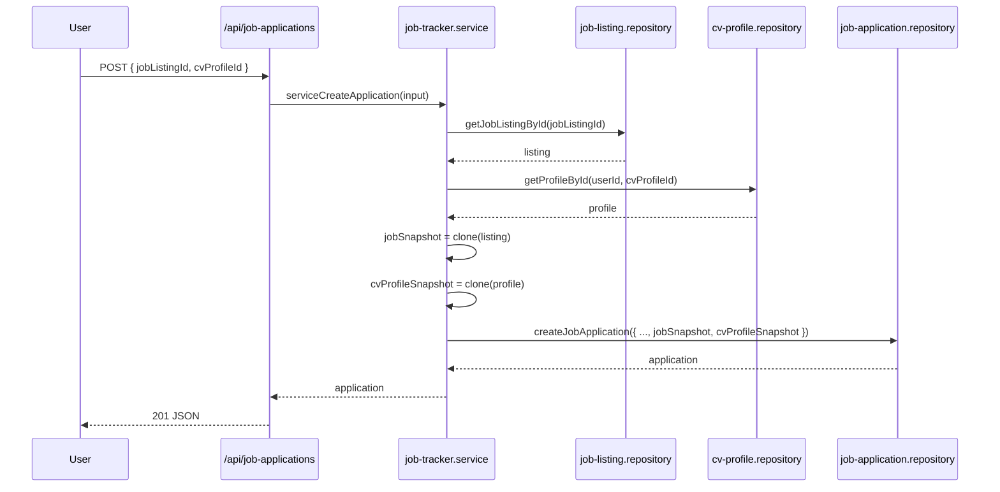
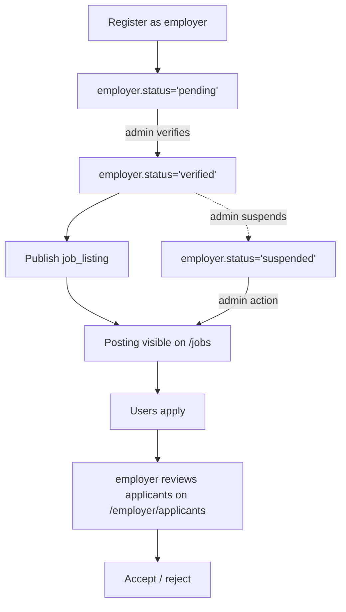
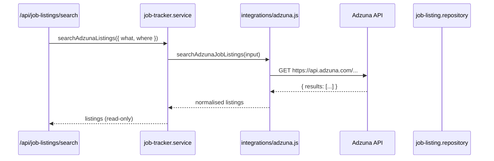
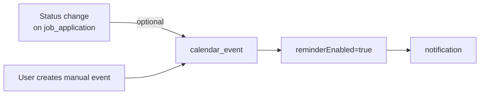

# Job Tracker

Job Tracker is the module that covers the entire application cycle: discovery of postings (both internal and imported from Adzuna), management of the candidate pipeline (wishlist → applied → interview → offer), a calendar of events, and the employer portal to publish postings and review applicants.

## Overview

## Data models involved

- [`job_listings`](../data-model/job-listing.md) — postings (internal + external).
- [`job_applications`](../data-model/job-application.md) — user applications.
- [`calendar_events`](../data-model/calendar-event.md) — interviews and reminders.
- [`employers`](../data-model/employer.md) — registered companies.
- [`cv_profiles`](../data-model/cv-profile.md) — user CVs (linked to applications).

## Application states

Defined in `lib/job-tracker/server/job-tracker.service.js` (`ALLOWED_APPLICATION_STATUSES`):

Every transition:

- Updates `lastActivityAt` and `previousStatus` (to detect changes).
- If `status === 'interview'` or `status === 'offer'`, the service can auto-create a `calendar_event` (configurable).

## Immutable snapshots

When creating a `job_application`, the service freezes:

- `jobSnapshot` — copy of the `job_listing` at the moment of application.
- `cvProfileSnapshot` — copy of the `cv_profile` sent.

This means that if the employer edits the posting or the user updates their CV, **historical applicants keep seeing what they sent**.

## Employer pipeline

- The employer **cannot publish postings** until their `employer.status` is `'verified'`.
- Once suspended, their listings are set to `isActive=false`.
- The endpoint `/api/employer/applicants/[applicationId]` filters by `employerId` of the requester: an employer only sees applicants to **their own** postings.

## Adzuna import

- The import is **on-demand** (it does not pre-populate the DB by default). The script `scripts/seed-job-listings.mjs` does a massive upsert into `job_listings`.
- If `ADZUNA_APP_ID` / `ADZUNA_APP_KEY` are missing, `isAdzunaConfigured()` returns `false` and the UI shows "Import disabled".
- The unique sparse index `{ source: 1, externalId: 1 }` guarantees automatic dedup.

## Calendar

Possible events (`ALLOWED_EVENT_TYPES`):

- `interview` — scheduled interview.
- `deadline` — deadline to respond.
- `follow_up` — reminder to follow up.
- `promised_response` — date promised by the employer.
- `reminder` — generic reminder.

Events are tied to a `job_application` (`scope === 'application'`) or are personal (`scope === 'personal'`).

## API surface

| Endpoint | Method | Purpose |
|---|---|---|
| `/api/job-listings` | GET | List active postings. |
| `/api/job-listings/:id` | GET | Posting detail. |
| `/api/job-applications` | GET / POST | List / create applications. |
| `/api/job-applications/:id` | GET / PATCH / DELETE | Detail + status change + soft delete. |
| `/api/job-applications/:id/restore` | POST | Restore soft-deleted. |
| `/api/calendar/events` | GET / POST | List / create events. |
| `/api/calendar/events/:id` | GET / PATCH / DELETE | Event detail. |
| `/api/employer/listings` | GET / POST | Employer: list / publish postings. |
| `/api/employer/listings/:id` | GET / PATCH / DELETE | Employer: edit / close posting. |
| `/api/employer/applicants` | GET | Employer: list applicants. |
| `/api/employer/applicants/:id` | GET / PATCH | Employer: review and decide. |
| `/api/employer/applicants/:id/profile` | GET | Employer: view full CV snapshot. |

## Permissions

| Role | Can view | Can write |
|---|---|---|
| `user` | Own applications, events, active listings | Own applications, events |
| `employer` (verified) | Own listings, applicants to own listings | Own listings |
| `employer` (pending/suspended) | Own listings (inactive) | — |
| `admin` | Everything | Everything |

`lib/server/auth/current-user.js` provides helpers `requireCurrentUser()`, `requireAdminUser()`, `requireEmployer()`.

## See also

- [`../architecture/data-flow.md`](../architecture/data-flow.md#6-job-application-apply-to-posting)
- [`../architecture/data-flow.md`](../architecture/data-flow.md#7-employer-publish-posting)
- [`../architecture/data-flow.md`](../architecture/data-flow.md#8-import-postings-from-adzuna)
- [`../data-model/job-listing.md`](../data-model/job-listing.md)
- [`../data-model/job-application.md`](../data-model/job-application.md)
- [`../data-model/calendar-event.md`](../data-model/calendar-event.md)
- [`../data-model/employer.md`](../data-model/employer.md)