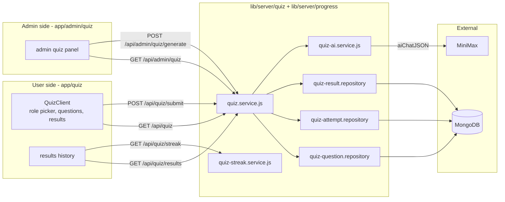
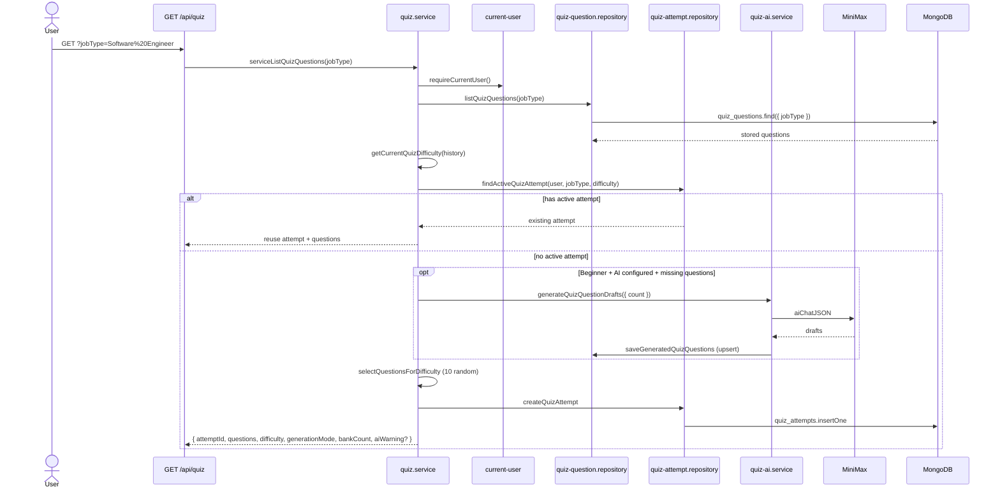
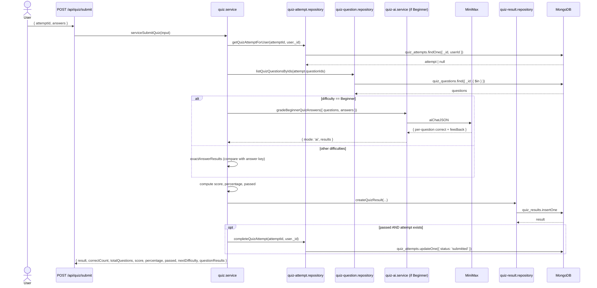
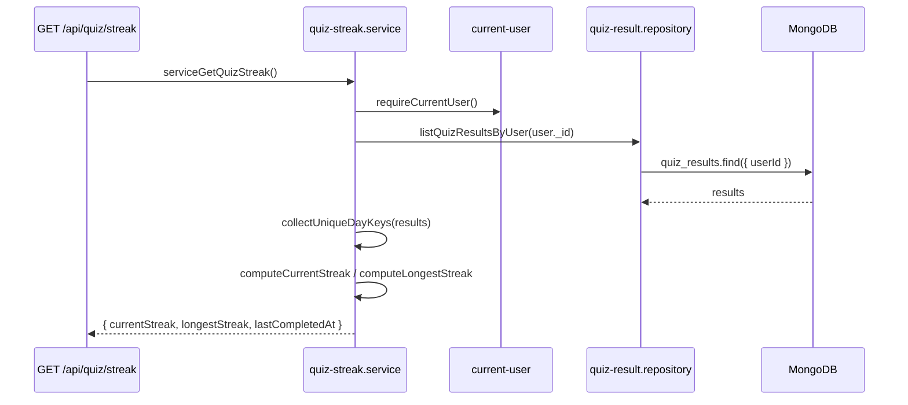
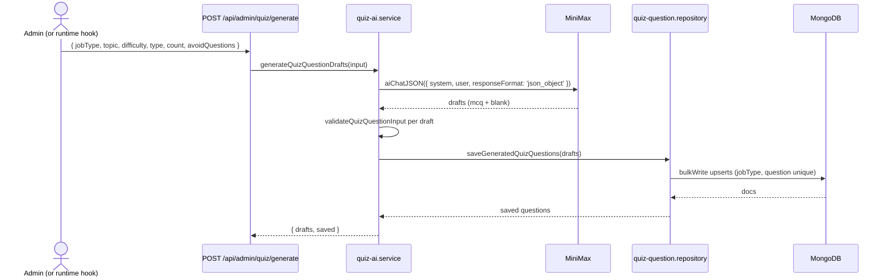

# Quiz

The Quiz module is the orientation engine of Career Forge. It helps users discover which roles fit them by attempting short, role-specific question sets that escalate in difficulty as they progress. Admins curate the question bank; AI can top it up on demand when the catalog runs thin.

## Overview



## Roles and difficulties

- **48 job roles** supported (see `lib/quiz/job-role-catalog.js`).
- **3 difficulties**: `Beginner`, `Intermediate`, `Advanced`.
- **10 questions per quiz** (`QUESTIONS_PER_QUIZ` in `quiz.service.js`).
- **Passing score**: 70% (`passed = percentage >= 70`).

The next difficulty a user faces is computed from their pass history for that `jobType`:

```js
// lib/server/quiz/quiz.service.js
if (passedDifficulties.has('Advanced') || passedDifficulties.has('Intermediate')) return 'Advanced'
if (passedDifficulties.has('Beginner')) return 'Intermediate'
return 'Beginner'
```

If the user passes at the current level **and** there are at least 10 questions available for the next level, they auto-advance.

## Question bank

Each question belongs to one `jobType` and one `difficulty`. Source is either `manual` (seeded) or `ai` (generated).

Bank controls (enforced by the seeder `npm run seed:quiz:ai` and the runtime generator):

- **Target per role**: 30 Beginner questions.
- **Absolute cap per role**: 40 Beginner questions.
- **Catalog target**: 1,440 Beginner questions (48 × 30).
- **Catalog cap**: 1,920 Beginner questions (48 × 40).

Indexes (`lib/db/models/quiz-question.js`):

- `{ jobType: 1 }` — filter by role.
- `{ jobType: 1, question: 1 }` unique — dedup by text per role.

See [`../data-model/quiz-question.md`](../data-model/quiz-question.md) for the full schema.

## Start a quiz

`GET /api/quiz?jobType=<role>` runs `serviceListQuizQuestions(jobType)`. The flow:



Key points:

- The response **never includes the answers** (`toPublicQuestions` strips `answer`).
- If the user already has an active attempt, it is reused (idempotent load).
- On `Beginner`, if fewer than 10 questions exist, AI can top up to the cap (40 per role).
- If AI generation fails, the user still gets the quiz with whatever stored questions are available; an `aiWarning` string is surfaced.

## Submit a quiz

`POST /api/quiz/submit { attemptId, answers }` runs `serviceSubmitQuiz(input)`.



Scoring rules:

- Score = `sum(marks of correct questions)`.
- Percentage = `score / totalMarks * 100`.
- `passed` if percentage ≥ 70.
- `gradingMode` is `'ai'` for Beginner (when AI grading succeeds) and `'answer-key'` otherwise.
- `feedback` is a short template-driven message keyed off the percentage bucket.

If the user has passed the current level and the next level has 10+ questions, `nextDifficulty` advances.

## Grading modes

| Difficulty | Grading | Why |
|---|---|---|
| Beginner | AI (`gradeBeginnerQuizAnswers`) | Allows short-answer and fill-in-the-blank questions that need semantic judgement. |
| Intermediate / Advanced | Answer-key (`exactAnswerResults`) | Faster, offline-capable, deterministic for MCQ. |

If the AI provider is unavailable on Beginner, the service **falls back to answer-key** so the user is never blocked.

## Streak

`GET /api/quiz/streak` runs `serviceGetQuizStreak()` (`lib/server/progress/quiz-streak.service.js`).

Two streaks are computed from `quiz_results.completedAt`:

- **`currentStreak`** — consecutive UTC days ending today (or yesterday). If the user hasn't played today or yesterday, the streak is 0.
- **`longestStreak`** — longest consecutive run of UTC days in the user's history.



## AI generation pipeline (admin / on-demand)

`POST /api/admin/quiz/generate` runs `serviceGenerateQuizQuestions(input)` → `generateQuizQuestionDrafts` → `saveGeneratedQuizQuestions`.



The system prompt enforces strict JSON shape (`{ questions: [...] }`), one-answer MCQs, and unbiased phrasing. `avoidQuestions` lets the caller pass existing question text so the generator doesn't repeat them.

The bulk upsert uses `filter: { jobType, question }` so the same wording for the same role is **never duplicated**.

## Admin endpoints

| Endpoint | Method | Purpose |
|---|---|---|
| `/api/admin/quiz` | GET | List every question in the bank. |
| `/api/admin/quiz/generate` | POST | Generate new questions via AI and upsert. |

All admin quiz endpoints require `requireAdminUser()`.

## Related data model

- [`quiz_questions`](../data-model/quiz-question.md) — bank.
- [`quiz_attempts`](../data-model/quiz-attempt.md) — active attempts.
- [`quiz_results`](../data-model/quiz-result.md) — historical results.

## See also

- [`../architecture/data-flow.md`](../architecture/data-flow.md#5-quiz-start--submit--grading) — the core sequence.
- `lib/quiz/job-role-catalog.js` — the 48-role catalog.
- `scripts/seed-quiz-ai.mjs` — bulk AI seeder.